# Animation Style Catalog

Short HTML canvas films demonstrate different animation styles. Each example is a self-contained clip of roughly 9–10 seconds. Choose a style before commissioning a new animation: “Explain this topic in the `blueprint` style.”

Watch the [complete English catalog](catalog/catalog.mp4), or browse by use case or visual family, or open a style below to see its translated video, animated preview, and HTML source.

This English adaptation is based on [Yasin Özmen’s original Turkish catalog](https://github.com/yasinozmeen/animasyon-stil-katalogu), which was made for [irticalen](https://irticalen.yasinozmeen.me). The examples retain references to irticalen where they are part of the original scene. Source: commit [`09e451d`](https://github.com/yasinozmeen/animasyon-stil-katalogu/commit/09e451d8b64ec85c1ec035fd39e00725c1ed5593).

<!-- styles:start -->
**By use case:** [Explainers](categories/use-cases/explainer.md) (32) · [Tutorials & Training](categories/use-cases/tutorial.md) (8) · [Product & Launches](categories/use-cases/product.md) (18) · [Social & Short-Form](categories/use-cases/social.md) (48) · [Storytelling & Brand](categories/use-cases/story.md) (55) · [Data & Results](categories/use-cases/data.md) (8) · [News & Current Affairs](categories/use-cases/news.md) (7) · [Intros, Titles & Transitions](categories/use-cases/titles.md) (30)

**By visual family:** [Flat Graphics](categories/families/flat-graphics.md) (7) · [Art Movements](categories/families/art-movements.md) (6) · [Hand Drawn](categories/families/hand-drawn.md) (8) · [Texture & Craft](categories/families/texture-craft.md) (15) · [Nostalgia](categories/families/nostalgia.md) (9) · [Technical](categories/families/technical.md) (8) · [Experimental](categories/families/experimental.md) (8) · [Polished & Premium](categories/families/polished.md) (2) · [Generative & 3D](categories/families/generative-3d.md) (8) · [Comics & Cartoons](categories/families/comics.md) (17) · [Games](categories/families/games.md) (8) · [World & History](categories/families/world-history.md) (13)

<table>
<tr>
<td width="25%" align="center"> <b>01 · Kurzgesagt</b> <a href="styles/kurzgesagt/kurzgesagt.mp4">video</a> · <a href="styles/kurzgesagt">source</a></td>
<td width="25%" align="center"> <b>02 · Isometric</b> <a href="styles/isometric/isometric.mp4">video</a> · <a href="styles/isometric">source</a></td>
<td width="25%" align="center"> <b>03 · Bauhaus</b> <a href="styles/bauhaus/bauhaus.mp4">video</a> · <a href="styles/bauhaus">source</a></td>
<td width="25%" align="center"> <b>04 · Memphis</b> <a href="styles/memphis/memphis.mp4">video</a> · <a href="styles/memphis">source</a></td>
</tr>
<tr>
<td width="25%" align="center"> <b>05 · Whiteboard</b> <a href="styles/whiteboard/whiteboard.mp4">video</a> · <a href="styles/whiteboard">source</a></td>
<td width="25%" align="center"> <b>06 · Chalkboard</b> <a href="styles/chalkboard/chalkboard.mp4">video</a> · <a href="styles/chalkboard">source</a></td>
<td width="25%" align="center"> <b>07 · Blueprint</b> <a href="styles/blueprint/blueprint.mp4">video</a> · <a href="styles/blueprint">source</a></td>
<td width="25%" align="center"> <b>08 · Single Line</b> <a href="styles/single-line/single-line.mp4">video</a> · <a href="styles/single-line">source</a></td>
</tr>
<tr>
<td width="25%" align="center"><a href="styles/paper-cutout/paper-cutout.mp4">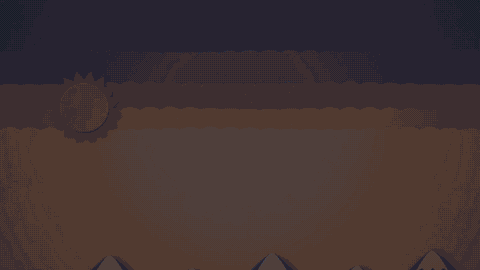</a> <b>09 · Paper Cutout</b> <a href="styles/paper-cutout/paper-cutout.mp4">video</a> · <a href="styles/paper-cutout">source</a></td>
<td width="25%" align="center"> <b>10 · Pencil Sketch</b> <a href="styles/pencil-sketch/pencil-sketch.mp4">video</a> · <a href="styles/pencil-sketch">source</a></td>
<td width="25%" align="center"> <b>11 · Linocut</b> <a href="styles/linocut/linocut.mp4">video</a> · <a href="styles/linocut">source</a></td>
<td width="25%" align="center"><a href="styles/clay/clay.mp4">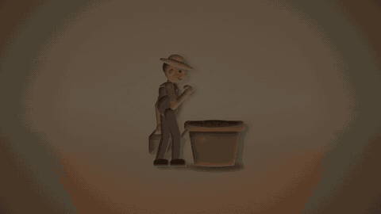</a> <b>12 · Clay</b> <a href="styles/clay/clay.mp4">video</a> · <a href="styles/clay">source</a></td>
</tr>
<tr>
<td width="25%" align="center"> <b>13 · 1970s Retro</b> <a href="styles/retro-1970s/retro-1970s.mp4">video</a> · <a href="styles/retro-1970s">source</a></td>
<td width="25%" align="center"> <b>14 · Pixel Art</b> <a href="styles/pixel-art/pixel-art.mp4">video</a> · <a href="styles/pixel-art">source</a></td>
<td width="25%" align="center"> <b>15 · 16 mm Documentary</b> <a href="styles/documentary-16mm/documentary-16mm.mp4">video</a> · <a href="styles/documentary-16mm">source</a></td>
<td width="25%" align="center"> <b>16 · Comic Book</b> <a href="styles/comic-book/comic-book.mp4">video</a> · <a href="styles/comic-book">source</a></td>
</tr>
<tr>
<td width="25%" align="center"> <b>17 · Terminal</b> <a href="styles/terminal/terminal.mp4">video</a> · <a href="styles/terminal">source</a></td>
<td width="25%" align="center"> <b>18 · Sci-Fi Interface</b> <a href="styles/sci-fi-interface/sci-fi-interface.mp4">video</a> · <a href="styles/sci-fi-interface">source</a></td>
<td width="25%" align="center"> <b>19 · Data Visualization</b> <a href="styles/data-visualization/data-visualization.mp4">video</a> · <a href="styles/data-visualization">source</a></td>
<td width="25%" align="center"> <b>20 · Kinetic Typography</b> <a href="styles/kinetic-typography/kinetic-typography.mp4">video</a> · <a href="styles/kinetic-typography">source</a></td>
</tr>
<tr>
<td width="25%" align="center"> <b>21 · Map Documentary</b> <a href="styles/map-documentary/map-documentary.mp4">video</a> · <a href="styles/map-documentary">source</a></td>
<td width="25%" align="center"> <b>22 · Liquid Glass</b> <a href="styles/liquid-glass/liquid-glass.mp4">video</a> · <a href="styles/liquid-glass">source</a></td>
<td width="25%" align="center"> <b>23 · Product UI</b> <a href="styles/product-ui/product-ui.mp4">video</a> · <a href="styles/product-ui">source</a></td>
<td width="25%" align="center"> <b>24 · 3Blue1Brown</b> <a href="styles/3blue1brown/3blue1brown.mp4">video</a> · <a href="styles/3blue1brown">source</a></td>
</tr>
<tr>
<td width="25%" align="center"> <b>25 · Mixed-Media Collage</b> <a href="styles/collage/collage.mp4">video</a> · <a href="styles/collage">source</a></td>
<td width="25%" align="center"> <b>26 · Risograph</b> <a href="styles/risograph/risograph.mp4">video</a> · <a href="styles/risograph">source</a></td>
<td width="25%" align="center"> <b>27 · Newspaper Headline</b> <a href="styles/newspaper/newspaper.mp4">video</a> · <a href="styles/newspaper">source</a></td>
<td width="25%" align="center"><a href="styles/neo-brutalism/neo-brutalism.mp4">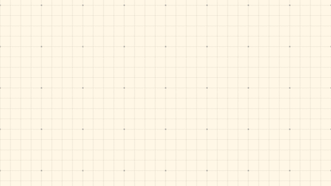</a> <b>28 · Neo-Brutalism</b> <a href="styles/neo-brutalism/neo-brutalism.mp4">video</a> · <a href="styles/neo-brutalism">source</a></td>
</tr>
<tr>
<td width="25%" align="center"><a href="styles/infographic/infographic.mp4">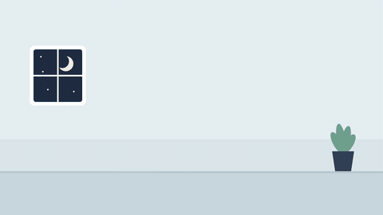</a> <b>29 · Infographic Explainer</b> <a href="styles/infographic/infographic.mp4">video</a> · <a href="styles/infographic">source</a></td>
<td width="25%" align="center"> <b>30 · Lo-Fi Anime</b> <a href="styles/lofi-anime/lofi-anime.mp4">video</a> · <a href="styles/lofi-anime">source</a></td>
<td width="25%" align="center"> <b>31 · Liquid Motion</b> <a href="styles/liquid-motion/liquid-motion.mp4">video</a> · <a href="styles/liquid-motion">source</a></td>
<td width="25%" align="center"> <b>32 · Synthwave</b> <a href="styles/synthwave/synthwave.mp4">video</a> · <a href="styles/synthwave">source</a></td>
</tr>
<tr>
<td width="25%" align="center"><a href="styles/frutiger-aero/frutiger-aero.mp4">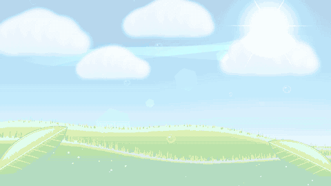</a> <b>33 · Frutiger Aero</b> <a href="styles/frutiger-aero/frutiger-aero.mp4">video</a> · <a href="styles/frutiger-aero">source</a></td>
<td width="25%" align="center"> <b>34 · VHS Camcorder</b> <a href="styles/vhs-camcorder/vhs-camcorder.mp4">video</a> · <a href="styles/vhs-camcorder">source</a></td>
<td width="25%" align="center"> <b>35 · Retro Desktop</b> <a href="styles/retro-desktop/retro-desktop.mp4">video</a> · <a href="styles/retro-desktop">source</a></td>
<td width="25%" align="center"> <b>36 · Vector Arcade</b> <a href="styles/vector-arcade/vector-arcade.mp4">video</a> · <a href="styles/vector-arcade">source</a></td>
</tr>
<tr>
<td width="25%" align="center"> <b>37 · Art Deco</b> <a href="styles/art-deco/art-deco.mp4">video</a> · <a href="styles/art-deco">source</a></td>
<td width="25%" align="center"> <b>38 · Ukiyo-e</b> <a href="styles/ukiyo-e/ukiyo-e.mp4">video</a> · <a href="styles/ukiyo-e">source</a></td>
<td width="25%" align="center"> <b>39 · Constructivism</b> <a href="styles/constructivism/constructivism.mp4">video</a> · <a href="styles/constructivism">source</a></td>
<td width="25%" align="center"> <b>40 · Art Nouveau</b> <a href="styles/art-nouveau/art-nouveau.mp4">video</a> · <a href="styles/art-nouveau">source</a></td>
</tr>
<tr>
<td width="25%" align="center"><a href="styles/rubber-hose/rubber-hose.mp4">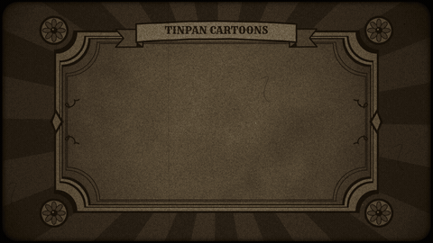</a> <b>41 · Rubber Hose</b> <a href="styles/rubber-hose/rubber-hose.mp4">video</a> · <a href="styles/rubber-hose">source</a></td>
<td width="25%" align="center"><a href="styles/silhouette/silhouette.mp4">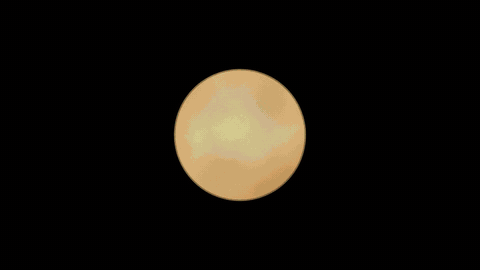</a> <b>42 · Silhouette Theater</b> <a href="styles/silhouette/silhouette.mp4">video</a> · <a href="styles/silhouette">source</a></td>
<td width="25%" align="center"> <b>43 · Manga</b> <a href="styles/manga/manga.mp4">video</a> · <a href="styles/manga">source</a></td>
<td width="25%" align="center"> <b>44 · Ink & Watercolor</b> <a href="styles/ink-wash/ink-wash.mp4">video</a> · <a href="styles/ink-wash">source</a></td>
</tr>
<tr>
<td width="25%" align="center"><a href="styles/stained-glass/stained-glass.mp4">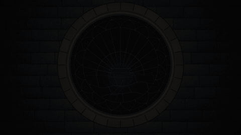</a> <b>45 · Stained Glass</b> <a href="styles/stained-glass/stained-glass.mp4">video</a> · <a href="styles/stained-glass">source</a></td>
<td width="25%" align="center"> <b>46 · Bold Captions</b> <a href="styles/bold-captions/bold-captions.mp4">video</a> · <a href="styles/bold-captions">source</a></td>
<td width="25%" align="center"> <b>47 · Chat Story</b> <a href="styles/chat-story/chat-story.mp4">video</a> · <a href="styles/chat-story">source</a></td>
<td width="25%" align="center"> <b>48 · Split-Flap Board</b> <a href="styles/split-flap/split-flap.mp4">video</a> · <a href="styles/split-flap">source</a></td>
</tr>
<tr>
<td width="25%" align="center"> <b>49 · Generative Particles</b> <a href="styles/particles/particles.mp4">video</a> · <a href="styles/particles">source</a></td>
<td width="25%" align="center"> <b>50 · ASCII Art</b> <a href="styles/ascii-art/ascii-art.mp4">video</a> · <a href="styles/ascii-art">source</a></td>
<td width="25%" align="center"> <b>51 · Low-Poly 3D</b> <a href="styles/low-poly/low-poly.mp4">video</a> · <a href="styles/low-poly">source</a></td>
<td width="25%" align="center"> <b>52 · Inflated 3D</b> <a href="styles/inflated-3d/inflated-3d.mp4">video</a> · <a href="styles/inflated-3d">source</a></td>
</tr>
<tr>
<td width="25%" align="center"><a href="styles/dither-1bit/dither-1bit.mp4">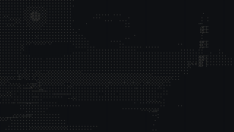</a> <b>53 · 1-Bit Dither</b> <a href="styles/dither-1bit/dither-1bit.mp4">video</a> · <a href="styles/dither-1bit">source</a></td>
<td width="25%" align="center"> <b>54 · Glitch</b> <a href="styles/glitch/glitch.mp4">video</a> · <a href="styles/glitch">source</a></td>
<td width="25%" align="center"><a href="styles/embroidery/embroidery.mp4">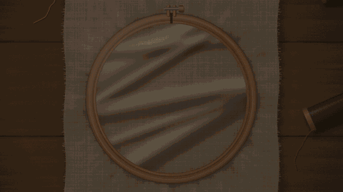</a> <b>55 · Embroidery</b> <a href="styles/embroidery/embroidery.mp4">video</a> · <a href="styles/embroidery">source</a></td>
<td width="25%" align="center"> <b>56 · Origami</b> <a href="styles/origami/origami.mp4">video</a> · <a href="styles/origami">source</a></td>
</tr>
<tr>
<td width="25%" align="center"><a href="styles/golden-age-comic/golden-age-comic.mp4">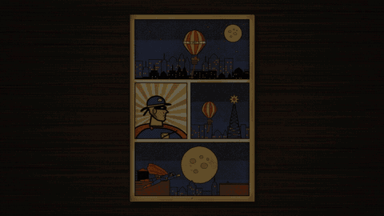</a> <b>57 · Golden Age Comic</b> <a href="styles/golden-age-comic/golden-age-comic.mp4">video</a> · <a href="styles/golden-age-comic">source</a></td>
<td width="25%" align="center"> <b>58 · Newspaper Comic Strip</b> <a href="styles/comic-strip/comic-strip.mp4">video</a> · <a href="styles/comic-strip">source</a></td>
<td width="25%" align="center"><a href="styles/clear-line/clear-line.mp4">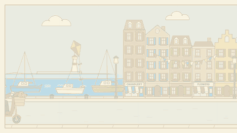</a> <b>59 · Clear-Line Comic</b> <a href="styles/clear-line/clear-line.mp4">video</a> · <a href="styles/clear-line">source</a></td>
<td width="25%" align="center"><a href="styles/dark-comic/dark-comic.mp4">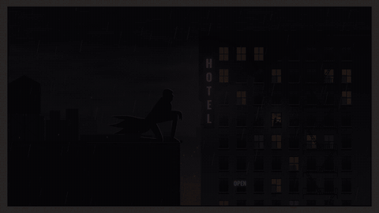</a> <b>60 · 80s Dark Comic</b> <a href="styles/dark-comic/dark-comic.mp4">video</a> · <a href="styles/dark-comic">source</a></td>
</tr>
<tr>
<td width="25%" align="center"><a href="styles/digital-comic/digital-comic.mp4">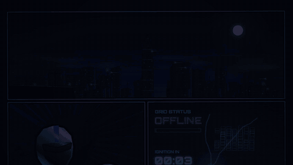</a> <b>61 · 2000s Digital Comic</b> <a href="styles/digital-comic/digital-comic.mp4">video</a> · <a href="styles/digital-comic">source</a></td>
<td width="25%" align="center"> <b>62 · Underground Comix</b> <a href="styles/underground-comix/underground-comix.mp4">video</a> · <a href="styles/underground-comix">source</a></td>
<td width="25%" align="center"><a href="styles/magazine-cartoon/magazine-cartoon.mp4">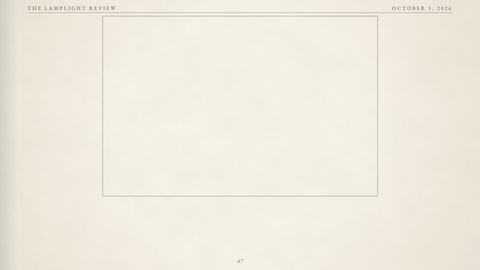</a> <b>63 · Magazine Cartoon</b> <a href="styles/magazine-cartoon/magazine-cartoon.mp4">video</a> · <a href="styles/magazine-cartoon">source</a></td>
<td width="25%" align="center"> <b>64 · Editorial Illustration</b> <a href="styles/editorial-illustration/editorial-illustration.mp4">video</a> · <a href="styles/editorial-illustration">source</a></td>
</tr>
<tr>
<td width="25%" align="center"><a href="styles/victorian-engraving/victorian-engraving.mp4">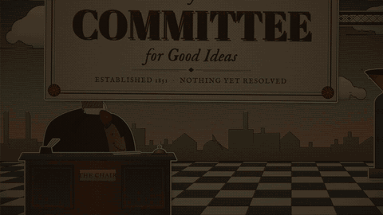</a> <b>65 · Victorian Engraving</b> <a href="styles/victorian-engraving/victorian-engraving.mp4">video</a> · <a href="styles/victorian-engraving">source</a></td>
<td width="25%" align="center"><a href="styles/scientific-plate/scientific-plate.mp4">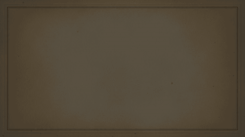</a> <b>66 · Scientific Plate</b> <a href="styles/scientific-plate/scientific-plate.mp4">video</a> · <a href="styles/scientific-plate">source</a></td>
<td width="25%" align="center"><a href="styles/anime-80s/anime-80s.mp4">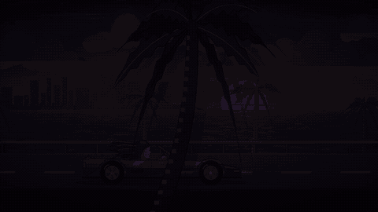</a> <b>67 · 80s Anime</b> <a href="styles/anime-80s/anime-80s.mp4">video</a> · <a href="styles/anime-80s">source</a></td>
<td width="25%" align="center"> <b>68 · Kawaii</b> <a href="styles/kawaii/kawaii.mp4">video</a> · <a href="styles/kawaii">source</a></td>
</tr>
<tr>
<td width="25%" align="center"> <b>69 · 8-Bit Console</b> <a href="styles/nes-8bit/nes-8bit.mp4">video</a> · <a href="styles/nes-8bit">source</a></td>
<td width="25%" align="center"><a href="styles/handheld-lcd/handheld-lcd.mp4">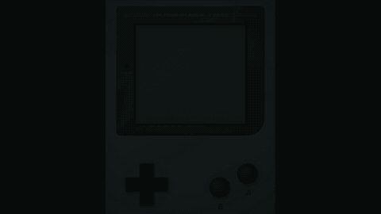</a> <b>70 · Handheld LCD</b> <a href="styles/handheld-lcd/handheld-lcd.mp4">video</a> · <a href="styles/handheld-lcd">source</a></td>
<td width="25%" align="center"><a href="styles/jrpg/jrpg.mp4">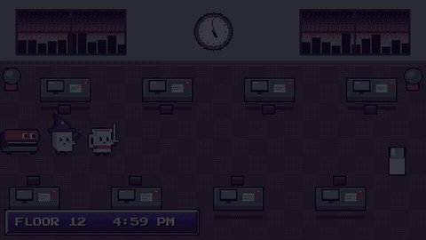</a> <b>71 · JRPG Battle</b> <a href="styles/jrpg/jrpg.mp4">video</a> · <a href="styles/jrpg">source</a></td>
<td width="25%" align="center"> <b>72 · Voxel Blocks</b> <a href="styles/voxel/voxel.mp4">video</a> · <a href="styles/voxel">source</a></td>
</tr>
<tr>
<td width="25%" align="center"> <b>73 · Point-and-Click Adventure</b> <a href="styles/point-and-click/point-and-click.mp4">video</a> · <a href="styles/point-and-click">source</a></td>
<td width="25%" align="center"><a href="styles/history-comedy/history-comedy.mp4">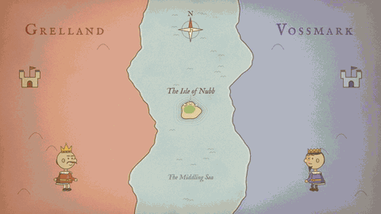</a> <b>74 · History Comedy</b> <a href="styles/history-comedy/history-comedy.mp4">video</a> · <a href="styles/history-comedy">source</a></td>
<td width="25%" align="center"> <b>75 · Absurd Minimal</b> <a href="styles/absurd-minimal/absurd-minimal.mp4">video</a> · <a href="styles/absurd-minimal">source</a></td>
<td width="25%" align="center"> <b>76 · Storytime Animation</b> <a href="styles/storytime/storytime.mp4">video</a> · <a href="styles/storytime">source</a></td>
</tr>
<tr>
<td width="25%" align="center"> <b>77 · Blob Simulation</b> <a href="styles/blob-sim/blob-sim.mp4">video</a> · <a href="styles/blob-sim">source</a></td>
<td width="25%" align="center"> <b>78 · Dark Documentary</b> <a href="styles/dark-documentary/dark-documentary.mp4">video</a> · <a href="styles/dark-documentary">source</a></td>
<td width="25%" align="center"> <b>79 · Cosmic Epic</b> <a href="styles/cosmic-epic/cosmic-epic.mp4">video</a> · <a href="styles/cosmic-epic">source</a></td>
<td width="25%" align="center"> <b>80 · Technical Cutaway</b> <a href="styles/technical-cutaway/technical-cutaway.mp4">video</a> · <a href="styles/technical-cutaway">source</a></td>
</tr>
<tr>
<td width="25%" align="center"> <b>81 · Stick-Figure Action</b> <a href="styles/stick-action/stick-action.mp4">video</a> · <a href="styles/stick-action">source</a></td>
<td width="25%" align="center"> <b>82 · Paint Doodle</b> <a href="styles/paint-doodle/paint-doodle.mp4">video</a> · <a href="styles/paint-doodle">source</a></td>
<td width="25%" align="center"> <b>83 · Neon Sign</b> <a href="styles/neon-sign/neon-sign.mp4">video</a> · <a href="styles/neon-sign">source</a></td>
<td width="25%" align="center"> <b>84 · Picture Book</b> <a href="styles/picture-book/picture-book.mp4">video</a> · <a href="styles/picture-book">source</a></td>
</tr>
<tr>
<td width="25%" align="center"> <b>85 · Office Satire Strip</b> <a href="styles/office-strip/office-strip.mp4">video</a> · <a href="styles/office-strip">source</a></td>
<td width="25%" align="center"> <b>86 · Absurd Webcomic</b> <a href="styles/absurd-webcomic/absurd-webcomic.mp4">video</a> · <a href="styles/absurd-webcomic">source</a></td>
<td width="25%" align="center"> <b>87 · Stick-Figure Webcomic</b> <a href="styles/stick-webcomic/stick-webcomic.mp4">video</a> · <a href="styles/stick-webcomic">source</a></td>
<td width="25%" align="center"><a href="styles/sunday-strip/sunday-strip.mp4">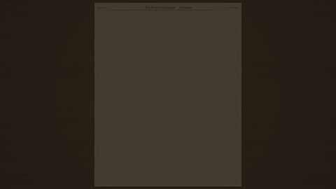</a> <b>88 · Sunday Watercolor Strip</b> <a href="styles/sunday-strip/sunday-strip.mp4">video</a> · <a href="styles/sunday-strip">source</a></td>
</tr>
<tr>
<td width="25%" align="center"> <b>89 · Minimal Line Strip</b> <a href="styles/minimal-strip/minimal-strip.mp4">video</a> · <a href="styles/minimal-strip">source</a></td>
<td width="25%" align="center"><a href="styles/single-panel-absurd/single-panel-absurd.mp4">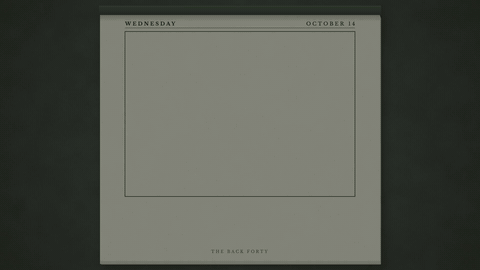</a> <b>90 · Absurd Single Panel</b> <a href="styles/single-panel-absurd/single-panel-absurd.mp4">video</a> · <a href="styles/single-panel-absurd">source</a></td>
<td width="25%" align="center"> <b>91 · Round-Head Dark Humor</b> <a href="styles/round-head-dark/round-head-dark.mp4">video</a> · <a href="styles/round-head-dark">source</a></td>
<td width="25%" align="center"> <b>92 · Relatable Webcomic</b> <a href="styles/relatable-webcomic/relatable-webcomic.mp4">video</a> · <a href="styles/relatable-webcomic">source</a></td>
</tr>
<tr>
<td width="25%" align="center"> <b>93 · Roman Mosaic</b> <a href="styles/roman-mosaic/roman-mosaic.mp4">video</a> · <a href="styles/roman-mosaic">source</a></td>
<td width="25%" align="center"> <b>94 · Greek Black-Figure</b> <a href="styles/greek-pottery/greek-pottery.mp4">video</a> · <a href="styles/greek-pottery">source</a></td>
<td width="25%" align="center"> <b>95 · Egyptian Papyrus</b> <a href="styles/egyptian-papyrus/egyptian-papyrus.mp4">video</a> · <a href="styles/egyptian-papyrus">source</a></td>
<td width="25%" align="center"> <b>96 · Norse Runestone</b> <a href="styles/viking-runes/viking-runes.mp4">video</a> · <a href="styles/viking-runes">source</a></td>
</tr>
<tr>
<td width="25%" align="center"> <b>97 · Illuminated Manuscript</b> <a href="styles/illuminated-manuscript/illuminated-manuscript.mp4">video</a> · <a href="styles/illuminated-manuscript">source</a></td>
<td width="25%" align="center"> <b>98 · Medieval Tapestry</b> <a href="styles/bayeux-tapestry/bayeux-tapestry.mp4">video</a> · <a href="styles/bayeux-tapestry">source</a></td>
<td width="25%" align="center"> <b>99 · Chinese Handscroll</b> <a href="styles/chinese-scroll/chinese-scroll.mp4">video</a> · <a href="styles/chinese-scroll">source</a></td>
<td width="25%" align="center"> <b>100 · Chinese Paper-Cut</b> <a href="styles/chinese-papercut/chinese-papercut.mp4">video</a> · <a href="styles/chinese-papercut">source</a></td>
</tr>
<tr>
<td width="25%" align="center"> <b>101 · Persian Miniature</b> <a href="styles/persian-miniature/persian-miniature.mp4">video</a> · <a href="styles/persian-miniature">source</a></td>
<td width="25%" align="center"> <b>102 · Geometric Tilework</b> <a href="styles/islamic-geometric/islamic-geometric.mp4">video</a> · <a href="styles/islamic-geometric">source</a></td>
<td width="25%" align="center"> <b>103 · Cave Painting</b> <a href="styles/cave-painting/cave-painting.mp4">video</a> · <a href="styles/cave-painting">source</a></td>
<td width="25%" align="center"> <b>104 · Codex</b> <a href="styles/mesoamerican-codex/mesoamerican-codex.mp4">video</a> · <a href="styles/mesoamerican-codex">source</a></td>
</tr>
<tr>
<td width="25%" align="center"> <b>106 · Papel Picado</b> <a href="styles/papel-picado/papel-picado.mp4">video</a> · <a href="styles/papel-picado">source</a></td>
<td width="25%" align="center"><a href="styles/flash-cartoon/flash-cartoon.mp4">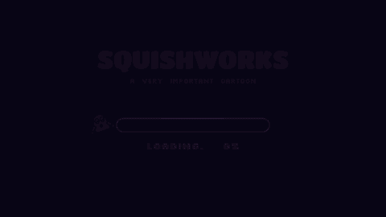</a> <b>107 · Flash Cartoon</b> <a href="styles/flash-cartoon/flash-cartoon.mp4">video</a> · <a href="styles/flash-cartoon">source</a></td>
<td width="25%" align="center"><a href="styles/atomic-wasteland/atomic-wasteland.mp4">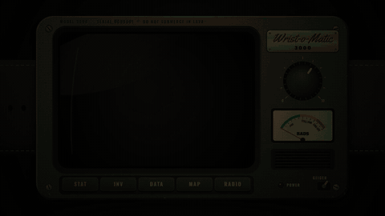</a> <b>114 · Atomic Wasteland</b> <a href="styles/atomic-wasteland/atomic-wasteland.mp4">video</a> · <a href="styles/atomic-wasteland">source</a></td>
<td width="25%" align="center"> <b>115 · Watercolor Memory</b> <a href="styles/watercolor-memory/watercolor-memory.mp4">video</a> · <a href="styles/watercolor-memory">source</a></td>
</tr>
<tr>
<td width="25%" align="center"> <b>116 · Cel-Shaded 3D</b> <a href="styles/cel-shaded-3d/cel-shaded-3d.mp4">video</a> · <a href="styles/cel-shaded-3d">source</a></td>
</tr>
</table>

| # | Style | Feel | Best for | Family | Use cases |
|---|---|---|---|---|---|
| 01 | [Kurzgesagt](styles/kurzgesagt/) | Bright, layered science documentary | Explaining a scientific idea with a sense of wonder | [Flat Graphics](categories/families/flat-graphics.md) | [Explainers](categories/use-cases/explainer.md), [Storytelling & Brand](categories/use-cases/story.md) |
| 02 | [Isometric](styles/isometric/) | Miniature model world | Showing the parts of a system or process | [Flat Graphics](categories/families/flat-graphics.md) | [Explainers](categories/use-cases/explainer.md), [Product & Launches](categories/use-cases/product.md) |
| 03 | [Bauhaus](styles/bauhaus/) | Poster grid and basic shapes | Steps, principles, and bold messages | [Art Movements](categories/families/art-movements.md) | [Social & Short-Form](categories/use-cases/social.md), [Intros, Titles & Transitions](categories/use-cases/titles.md), [Explainers](categories/use-cases/explainer.md) |
| 04 | [Memphis](styles/memphis/) | Playful, bouncing 1980s design | Fun announcements and short videos | [Art Movements](categories/families/art-movements.md) | [Social & Short-Form](categories/use-cases/social.md), [Product & Launches](categories/use-cases/product.md) |
| 05 | [Whiteboard](styles/whiteboard/) | A lesson drawn as it unfolds | Step-by-step explanations | [Hand Drawn](categories/families/hand-drawn.md) | [Explainers](categories/use-cases/explainer.md), [Tutorials & Training](categories/use-cases/tutorial.md) |
| 06 | [Chalkboard](styles/chalkboard/) | Chalk-drawn classroom lesson | Teaching a rule or memorable point | [Hand Drawn](categories/families/hand-drawn.md) | [Tutorials & Training](categories/use-cases/tutorial.md), [Explainers](categories/use-cases/explainer.md) |
| 07 | [Blueprint](styles/blueprint/) | Engineering drawing | Measurements, technical details, and inner workings | [Hand Drawn](categories/families/hand-drawn.md) | [Explainers](categories/use-cases/explainer.md), [Product & Launches](categories/use-cases/product.md) |
| 08 | [Single Line](styles/single-line/) | One continuous, minimal line | Elegant intros, outros, and transitions | [Hand Drawn](categories/families/hand-drawn.md) | [Intros, Titles & Transitions](categories/use-cases/titles.md), [Storytelling & Brand](categories/use-cases/story.md) |
| 09 | [Paper Cutout](styles/paper-cutout/) | Layered cardboard diorama | Storytelling and emotional openings | [Texture & Craft](categories/families/texture-craft.md) | [Storytelling & Brand](categories/use-cases/story.md), [Intros, Titles & Transitions](categories/use-cases/titles.md) |
| 10 | [Pencil Sketch](styles/pencil-sketch/) | Graphite sketchbook | Showing how an idea develops | [Texture & Craft](categories/families/texture-craft.md) | [Storytelling & Brand](categories/use-cases/story.md), [Explainers](categories/use-cases/explainer.md) |
| 11 | [Linocut](styles/linocut/) | Carved print in black and red | A strong single message or manifesto | [Texture & Craft](categories/families/texture-craft.md) | [Storytelling & Brand](categories/use-cases/story.md), [Social & Short-Form](categories/use-cases/social.md) |
| 12 | [Clay](styles/clay/) | Warm stop motion | Friendly, playful storytelling | [Texture & Craft](categories/families/texture-craft.md) | [Storytelling & Brand](categories/use-cases/story.md), [Social & Short-Form](categories/use-cases/social.md) |
| 13 | [1970s Retro](styles/retro-1970s/) | Vintage television titles | Nostalgic openings and series titles | [Nostalgia](categories/families/nostalgia.md) | [Intros, Titles & Transitions](categories/use-cases/titles.md), [Storytelling & Brand](categories/use-cases/story.md) |
| 14 | [Pixel Art](styles/pixel-art/) | 16-bit platform game | Progress, milestones, and game-like scenes | [Games](categories/families/games.md) | [Social & Short-Form](categories/use-cases/social.md), [Storytelling & Brand](categories/use-cases/story.md), [Data & Results](categories/use-cases/data.md) |
| 15 | [16 mm Documentary](styles/documentary-16mm/) | Vintage black-and-white film | History and origin stories | [Nostalgia](categories/families/nostalgia.md) | [Storytelling & Brand](categories/use-cases/story.md) |
| 16 | [Comic Book](styles/comic-book/) | Newspaper comic panels | Dialogue, humor, and tension | [Comics & Cartoons](categories/families/comics.md) | [Storytelling & Brand](categories/use-cases/story.md), [Social & Short-Form](categories/use-cases/social.md) |
| 17 | [Terminal](styles/terminal/) | Green phosphor command line | Technical processes and what happens behind the scenes | [Technical](categories/families/technical.md) | [Explainers](categories/use-cases/explainer.md), [Product & Launches](categories/use-cases/product.md) |
| 18 | [Sci-Fi Interface](styles/sci-fi-interface/) | Cool HUD, radar, and analysis | Measurement, scoring, and diagnostics | [Technical](categories/families/technical.md) | [Data & Results](categories/use-cases/data.md), [Product & Launches](categories/use-cases/product.md) |
| 19 | [Data Visualization](styles/data-visualization/) | Editorial charts | Evidence in numbers and before/after comparisons | [Technical](categories/families/technical.md) | [Data & Results](categories/use-cases/data.md), [News & Current Affairs](categories/use-cases/news.md) |
| 20 | [Kinetic Typography](styles/kinetic-typography/) | Words in rhythm | Quotes and strong opening lines | [Experimental](categories/families/experimental.md) | [Intros, Titles & Transitions](categories/use-cases/titles.md), [Social & Short-Form](categories/use-cases/social.md) |
| 21 | [Map Documentary](styles/map-documentary/) | Pinned paper map with red string | Journeys, how things spread, and well-researched stories | [Texture & Craft](categories/families/texture-craft.md) | [Explainers](categories/use-cases/explainer.md), [News & Current Affairs](categories/use-cases/news.md), [Storytelling & Brand](categories/use-cases/story.md) |
| 22 | [Liquid Glass](styles/liquid-glass/) | Refractive glass morphing over a glowing aurora | Premium product reveals, feature launches, and polished title cards | [Polished & Premium](categories/families/polished.md) | [Product & Launches](categories/use-cases/product.md), [Intros, Titles & Transitions](categories/use-cases/titles.md) |
| 23 | [Product UI](styles/product-ui/) | Polished SaaS app demo with cursor, zooms and callouts | Feature launches, app walkthroughs, and onboarding | [Technical](categories/families/technical.md) | [Product & Launches](categories/use-cases/product.md), [Tutorials & Training](categories/use-cases/tutorial.md) |
| 24 | [3Blue1Brown](styles/3blue1brown/) | Manim-style math on black | Math intuition, visual proofs, and step-by-step derivations | [Technical](categories/families/technical.md) | [Explainers](categories/use-cases/explainer.md), [Tutorials & Training](categories/use-cases/tutorial.md), [Data & Results](categories/use-cases/data.md) |
| 25 | [Mixed-Media Collage](styles/collage/) | Torn paper, tape and halftone cutouts | Manifestos, handmade brands, and scroll-stopping social posts | [Texture & Craft](categories/families/texture-craft.md) | [Storytelling & Brand](categories/use-cases/story.md), [Social & Short-Form](categories/use-cases/social.md) |
| 26 | [Risograph](styles/risograph/) | Fluorescent overprint with halftone dots | Event posters, bold titles, and punchy social hooks | [Texture & Craft](categories/families/texture-craft.md) | [Social & Short-Form](categories/use-cases/social.md), [Intros, Titles & Transitions](categories/use-cases/titles.md) |
| 27 | [Newspaper Headline](styles/newspaper/) | Broadsheet front page, ink and halftone | Breaking facts, surprising findings, and documentary hooks | [Nostalgia](categories/families/nostalgia.md) | [News & Current Affairs](categories/use-cases/news.md), [Social & Short-Form](categories/use-cases/social.md) |
| 28 | [Neo-Brutalism](styles/neo-brutalism/) | Chunky UI cards, hard shadows | App launches, product promos, and punchy social clips | [Flat Graphics](categories/families/flat-graphics.md) | [Social & Short-Form](categories/use-cases/social.md), [Product & Launches](categories/use-cases/product.md) |
| 29 | [Infographic Explainer](styles/infographic/) | Flat icons, counters and simple characters | Fast explainers with stats, steps, and everyday examples | [Flat Graphics](categories/families/flat-graphics.md) | [Explainers](categories/use-cases/explainer.md) |
| 30 | [Lo-Fi Anime](styles/lofi-anime/) | Rainy cozy 90s anime dusk | Calm moods, quiet stories, and study-night atmosphere | [Nostalgia](categories/families/nostalgia.md) | [Storytelling & Brand](categories/use-cases/story.md) |
| 31 | [Liquid Motion](styles/liquid-motion/) | Gooey blobs in warm flowing gradients | Wellness brands, calm title cards, and soft product intros | [Polished & Premium](categories/families/polished.md) | [Intros, Titles & Transitions](categories/use-cases/titles.md), [Product & Launches](categories/use-cases/product.md) |
| 32 | [Synthwave](styles/synthwave/) | Neon grid, chrome logo, sunset | Retro-futurist openers, series titles, and hype reels | [Nostalgia](categories/families/nostalgia.md) | [Intros, Titles & Transitions](categories/use-cases/titles.md), [Social & Short-Form](categories/use-cases/social.md) |
| 33 | [Frutiger Aero](styles/frutiger-aero/) | Glossy bubbles, blue skies, green grass | Cheerful app launches, playful promos, and nostalgic social posts | [Nostalgia](categories/families/nostalgia.md) | [Social & Short-Form](categories/use-cases/social.md), [Product & Launches](categories/use-cases/product.md) |
| 34 | [VHS Camcorder](styles/vhs-camcorder/) | 90s home video on a VCR | Nostalgic memories, throwbacks, and found-footage hooks | [Nostalgia](categories/families/nostalgia.md) | [Storytelling & Brand](categories/use-cases/story.md), [Social & Short-Form](categories/use-cases/social.md) |
| 35 | [Retro Desktop](styles/retro-desktop/) | Mid-90s desktop on a CRT | Nostalgic stories, tech humor, and step-by-step computer tutorials | [Nostalgia](categories/families/nostalgia.md) | [Storytelling & Brand](categories/use-cases/story.md), [Tutorials & Training](categories/use-cases/tutorial.md) |
| 36 | [Vector Arcade](styles/vector-arcade/) | Glowing phosphor lines on black | Game-style openers, retro title cards, and punchy social clips | [Games](categories/families/games.md) | [Intros, Titles & Transitions](categories/use-cases/titles.md), [Social & Short-Form](categories/use-cases/social.md) |
| 37 | [Art Deco](styles/art-deco/) | Gold sunbursts, stepped frames, symmetry | Gala invitations, elegant openers, and period brand stories | [Art Movements](categories/families/art-movements.md) | [Intros, Titles & Transitions](categories/use-cases/titles.md), [Storytelling & Brand](categories/use-cases/story.md) |
| 38 | [Ukiyo-e](styles/ukiyo-e/) | Woodblock waves, washi and seal | Calm, crafted stories and elegant title openers | [Art Movements](categories/families/art-movements.md) | [Storytelling & Brand](categories/use-cases/story.md), [Intros, Titles & Transitions](categories/use-cases/titles.md) |
| 39 | [Constructivism](styles/constructivism/) | Red wedges and shouting diagonals | Calls to action, manifestos, and loud announcements | [Art Movements](categories/families/art-movements.md) | [Social & Short-Form](categories/use-cases/social.md), [News & Current Affairs](categories/use-cases/news.md) |
| 40 | [Art Nouveau](styles/art-nouveau/) | Whiplash vines, mosaic halos, pastel lithograph | Perfume and beauty launches, storybook openers, heritage brands | [Art Movements](categories/families/art-movements.md) | [Storytelling & Brand](categories/use-cases/story.md), [Product & Launches](categories/use-cases/product.md) |
| 41 | [Rubber Hose](styles/rubber-hose/) | 1930s bouncing sepia cartoon | Playful gags, mascots, and nostalgic brand shorts | [Hand Drawn](categories/families/hand-drawn.md) | [Social & Short-Form](categories/use-cases/social.md), [Storytelling & Brand](categories/use-cases/story.md) |
| 42 | [Silhouette Theater](styles/silhouette/) | Backlit cut-paper shadow puppets | Fables, fairy tales and gentle, wordless storytelling | [Texture & Craft](categories/families/texture-craft.md) | [Storytelling & Brand](categories/use-cases/story.md) |
| 43 | [Manga](styles/manga/) | Inked panels, screentone and speed lines | Tense moments, big reveals, and dramatic countdowns | [Comics & Cartoons](categories/families/comics.md) | [Storytelling & Brand](categories/use-cases/story.md), [Social & Short-Form](categories/use-cases/social.md) |
| 44 | [Ink & Watercolor](styles/ink-wash/) | Sumi-e brush and blooming washes | Quiet, poetic stories and graceful title openers | [Hand Drawn](categories/families/hand-drawn.md) | [Storytelling & Brand](categories/use-cases/story.md), [Intros, Titles & Transitions](categories/use-cases/titles.md) |
| 45 | [Stained Glass](styles/stained-glass/) | Leaded jewel glass, sunlight through | Warm openings, luminous titles and quietly grand stories | [Texture & Craft](categories/families/texture-craft.md) | [Storytelling & Brand](categories/use-cases/story.md), [Intros, Titles & Transitions](categories/use-cases/titles.md) |
| 46 | [Bold Captions](styles/bold-captions/) | Word-by-word punchy short-form captions | Reels, Shorts and quick tips that must hook fast | [Experimental](categories/families/experimental.md) | [Social & Short-Form](categories/use-cases/social.md), [Tutorials & Training](categories/use-cases/tutorial.md) |
| 47 | [Chat Story](styles/chat-story/) | A story told in phone messages | Funny exchanges, twists, and relatable social moments | [Technical](categories/families/technical.md) | [Storytelling & Brand](categories/use-cases/story.md), [Social & Short-Form](categories/use-cases/social.md) |
| 48 | [Split-Flap Board](styles/split-flap/) | Clattering mechanical departures board | Headlines, schedules, announcements and big reveals | [Experimental](categories/families/experimental.md) | [News & Current Affairs](categories/use-cases/news.md), [Intros, Titles & Transitions](categories/use-cases/titles.md) |
| 49 | [Generative Particles](styles/particles/) | Luminous flow-field particle swarms | Tech title reveals, data stories, and abstract openers | [Generative & 3D](categories/families/generative-3d.md) | [Intros, Titles & Transitions](categories/use-cases/titles.md), [Data & Results](categories/use-cases/data.md) |
| 50 | [ASCII Art](styles/ascii-art/) | Pictures built from glowing characters | Title reveals and playful technical explainers | [Technical](categories/families/technical.md) | [Intros, Titles & Transitions](categories/use-cases/titles.md), [Explainers](categories/use-cases/explainer.md) |
| 51 | [Low-Poly 3D](styles/low-poly/) | Faceted, flat-shaded miniature 3D worlds | Friendly 3D explainers, world-building and product teasers | [Generative & 3D](categories/families/generative-3d.md) | [Explainers](categories/use-cases/explainer.md), [Product & Launches](categories/use-cases/product.md) |
| 52 | [Inflated 3D](styles/inflated-3d/) | Puffy pastel balloon icons that squish | Playful app features, social teasers and UI reveals | [Generative & 3D](categories/families/generative-3d.md) | [Product & Launches](categories/use-cases/product.md), [Social & Short-Form](categories/use-cases/social.md) |
| 53 | [1-Bit Dither](styles/dither-1bit/) | Two inks, ordered dither, stormy night | Moody stories, mysteries and atmospheric title cards | [Experimental](categories/families/experimental.md) | [Storytelling & Brand](categories/use-cases/story.md), [Intros, Titles & Transitions](categories/use-cases/titles.md) |
| 54 | [Glitch](styles/glitch/) | Corrupted digital signal, beat-synced | Bold title hits, reveals, and high-energy social openers | [Experimental](categories/families/experimental.md) | [Intros, Titles & Transitions](categories/use-cases/titles.md), [Social & Short-Form](categories/use-cases/social.md) |
| 55 | [Embroidery](styles/embroidery/) | Hand-stitched thread in a wooden hoop | Heartfelt stories, handmade brands, and cozy social posts | [Texture & Craft](categories/families/texture-craft.md) | [Storytelling & Brand](categories/use-cases/story.md), [Social & Short-Form](categories/use-cases/social.md) |
| 56 | [Origami](styles/origami/) | Folded paper, crisp creases, soft shadows | Step-by-step explainers, transformations and gentle brand stories | [Texture & Craft](categories/families/texture-craft.md) | [Explainers](categories/use-cases/explainer.md), [Storytelling & Brand](categories/use-cases/story.md) |
| 57 | [Golden Age Comic](styles/golden-age-comic/) | Pulpy, off-register 1940s heroics | Origin stories, heroic reveals, and cliffhanger teasers | [Comics & Cartoons](categories/families/comics.md) | [Storytelling & Brand](categories/use-cases/story.md), [Social & Short-Form](categories/use-cases/social.md) |
| 58 | [Newspaper Comic Strip](styles/comic-strip/) | Four panels, ink on newsprint | Dry wit, a setup, a beat, and a punchline | [Comics & Cartoons](categories/families/comics.md) | [Social & Short-Form](categories/use-cases/social.md), [Storytelling & Brand](categories/use-cases/story.md) |
| 59 | [Clear-Line Comic](styles/clear-line/) | Clean ink, flat colour, adventure | Journeys, places, and stories told panel by panel | [Comics & Cartoons](categories/families/comics.md) | [Explainers](categories/use-cases/explainer.md), [Storytelling & Brand](categories/use-cases/story.md) |
| 60 | [80s Dark Comic](styles/dark-comic/) | Rain, neon and spotted blacks | Brooding stories, noir narration and slow-burn reveals | [Comics & Cartoons](categories/families/comics.md) | [Storytelling & Brand](categories/use-cases/story.md) |
| 61 | [2000s Digital Comic](styles/digital-comic/) | Glossy airbrush, rim light, flares | Launch teasers, hero moments and high-energy product reveals | [Comics & Cartoons](categories/families/comics.md) | [Product & Launches](categories/use-cases/product.md), [Social & Short-Form](categories/use-cases/social.md) |
| 62 | [Underground Comix](styles/underground-comix/) | Boiling hatching, melting psychedelic swagger | Irreverent social clips, laid-back gags and trippy reveals | [Comics & Cartoons](categories/families/comics.md) | [Social & Short-Form](categories/use-cases/social.md) |
| 63 | [Magazine Cartoon](styles/magazine-cartoon/) | Dry wit, pen and wash | Punchlines, wry observations, and understated social commentary | [Comics & Cartoons](categories/families/comics.md) | [Social & Short-Form](categories/use-cases/social.md), [Storytelling & Brand](categories/use-cases/story.md) |
| 64 | [Editorial Illustration](styles/editorial-illustration/) | Witty op-ed metaphor, riso-grained | Opinion pieces, big ideas and thoughtful news explainers | [Flat Graphics](categories/families/flat-graphics.md) | [News & Current Affairs](categories/use-cases/news.md), [Explainers](categories/use-cases/explainer.md) |
| 65 | [Victorian Engraving](styles/victorian-engraving/) | Engraved cut-outs, hinged heads, giant feet | Droll satire, absurd explainers, and witty social posts | [Texture & Craft](categories/families/texture-craft.md) | [Social & Short-Form](categories/use-cases/social.md), [Storytelling & Brand](categories/use-cases/story.md) |
| 66 | [Scientific Plate](styles/scientific-plate/) | Engraved specimens, hand-tinted, numbered | Anatomy, classification, and patient close looks at things | [Texture & Craft](categories/families/texture-craft.md) | [Explainers](categories/use-cases/explainer.md) |
| 67 | [80s Anime](styles/anime-80s/) | Sunset cels, city-pop coastal drive | Retro title openers, road-trip stories, and nostalgic intros | [Nostalgia](categories/families/nostalgia.md) | [Intros, Titles & Transitions](categories/use-cases/titles.md), [Storytelling & Brand](categories/use-cases/story.md) |
| 68 | [Kawaii](styles/kawaii/) | Pastel chibi stickers that bounce | Cheerful social posts, cute products and friendly greetings | [Flat Graphics](categories/families/flat-graphics.md) | [Social & Short-Form](categories/use-cases/social.md), [Product & Launches](categories/use-cases/product.md) |
| 69 | [8-Bit Console](styles/nes-8bit/) | Third-generation console cartridge game | Playful quests, streaks, scores, and level-up moments | [Games](categories/families/games.md) | [Social & Short-Form](categories/use-cases/social.md), [Data & Results](categories/use-cases/data.md) |
| 70 | [Handheld LCD](styles/handheld-lcd/) | Four greens on a pocket console | Playful social posts, game moments and retro nostalgia | [Games](categories/families/games.md) | [Social & Short-Form](categories/use-cases/social.md) |
| 71 | [JRPG Battle](styles/jrpg/) | 16-bit turn-based battle menus | Challenges overcome, skill unlocks, and playful explainers | [Games](categories/families/games.md) | [Explainers](categories/use-cases/explainer.md), [Social & Short-Form](categories/use-cases/social.md) |
| 72 | [Voxel Blocks](styles/voxel/) | Blocky sandbox, built block by block | Step-by-step tutorials, building processes and game-style explainers | [Games](categories/families/games.md) | [Tutorials & Training](categories/use-cases/tutorial.md), [Explainers](categories/use-cases/explainer.md) |
| 73 | [Point-and-Click Adventure](styles/point-and-click/) | Dithered early-90s adventure game | Wry quests, puzzles, reveals, and story beats with dialogue | [Games](categories/families/games.md) | [Storytelling & Brand](categories/use-cases/story.md), [Social & Short-Form](categories/use-cases/social.md) |
| 74 | [History Comedy](styles/history-comedy/) | Big-headed kings on parchment maps | Funny history, wars, treaties, and absurd true-ish stories | [Flat Graphics](categories/families/flat-graphics.md) | [Explainers](categories/use-cases/explainer.md), [Storytelling & Brand](categories/use-cases/story.md) |
| 75 | [Absurd Minimal](styles/absurd-minimal/) | Fast deadpan doodles on loud color | Rapid-fire explainers and history told with a shrug | [Experimental](categories/families/experimental.md) | [Explainers](categories/use-cases/explainer.md), [Social & Short-Form](categories/use-cases/social.md) |
| 76 | [Storytime Animation](styles/storytime/) | Expressive self-insert, deadpan inner thoughts | Personal anecdotes, embarrassing mishaps, and relatable confessions | [Hand Drawn](categories/families/hand-drawn.md) | [Storytelling & Brand](categories/use-cases/story.md), [Social & Short-Form](categories/use-cases/social.md) |
| 77 | [Blob Simulation](styles/blob-sim/) | Cute 3D blobs obeying simple rules | Game theory, evolution sims, and data-driven explainers | [Generative & 3D](categories/families/generative-3d.md) | [Explainers](categories/use-cases/explainer.md), [Data & Results](categories/use-cases/data.md) |
| 78 | [Dark Documentary](styles/dark-documentary/) | Cold, quiet, redacted mystery | Unsolved mysteries, investigations, and slow-burn true stories | [Technical](categories/families/technical.md) | [Storytelling & Brand](categories/use-cases/story.md), [News & Current Affairs](categories/use-cases/news.md) |
| 79 | [Cosmic Epic](styles/cosmic-epic/) | Vast, glowing, awe-struck deep time | Epic title reveals and big-picture science timelines | [Generative & 3D](categories/families/generative-3d.md) | [Intros, Titles & Transitions](categories/use-cases/titles.md), [Explainers](categories/use-cases/explainer.md) |
| 80 | [Technical Cutaway](styles/technical-cutaway/) | Exploded 3D model with callouts | How machines work, product internals and engineering explainers | [Generative & 3D](categories/families/generative-3d.md) | [Explainers](categories/use-cases/explainer.md), [Product & Launches](categories/use-cases/product.md) |
| 81 | [Stick-Figure Action](styles/stick-action/) | Snappy stick-figure fights on paper | Punchy social clips, rivalries, and playful action beats | [Hand Drawn](categories/families/hand-drawn.md) | [Social & Short-Form](categories/use-cases/social.md) |
| 82 | [Paint Doodle](styles/paint-doodle/) | Crude mouse lines, deadpan captions | Silly history bits and dry jokes for social feeds | [Experimental](categories/families/experimental.md) | [Social & Short-Form](categories/use-cases/social.md) |
| 83 | [Neon Sign](styles/neon-sign/) | Glass tubes buzzing on wet brick | Night-time titles, venue openers, and moody channel intros | [Texture & Craft](categories/families/texture-craft.md) | [Intros, Titles & Transitions](categories/use-cases/titles.md) |
| 84 | [Picture Book](styles/picture-book/) | Gouache storybook with turning pages | Bedtime-gentle stories, fables, and warm step-by-step lessons | [Texture & Craft](categories/families/texture-craft.md) | [Storytelling & Brand](categories/use-cases/story.md), [Tutorials & Training](categories/use-cases/tutorial.md) |
| 85 | [Office Satire Strip](styles/office-strip/) | Deadpan cubicle wit, flat ink | Workplace satire, buzzwords, and a dry final-panel punchline | [Comics & Cartoons](categories/families/comics.md) | [Social & Short-Form](categories/use-cases/social.md), [Storytelling & Brand](categories/use-cases/story.md) |
| 86 | [Absurd Webcomic](styles/absurd-webcomic/) | Loud flat cartoons, unhinged overreactions | Relatable gripes, product pain points, and escalating social gags | [Comics & Cartoons](categories/families/comics.md) | [Social & Short-Form](categories/use-cases/social.md), [Product & Launches](categories/use-cases/product.md) |
| 87 | [Stick-Figure Webcomic](styles/stick-webcomic/) | Dry nerdy wit in black ink | Wry explainers, tradeoffs, and charts with a punchline | [Comics & Cartoons](categories/families/comics.md) | [Explainers](categories/use-cases/explainer.md), [Data & Results](categories/use-cases/data.md) |
| 88 | [Sunday Watercolor Strip](styles/sunday-strip/) | Brush ink, washes, imagination unleashed | Childhood daydreams, reality-vs-fantasy turns, and a dry parental punchline | [Comics & Cartoons](categories/families/comics.md) | [Storytelling & Brand](categories/use-cases/story.md), [Social & Short-Form](categories/use-cases/social.md) |
| 89 | [Minimal Line Strip](styles/minimal-strip/) | Trembling pen, white space, quiet wit | Gentle philosophical humor and a tender four-panel punchline | [Comics & Cartoons](categories/families/comics.md) | [Storytelling & Brand](categories/use-cases/story.md) |
| 90 | [Absurd Single Panel](styles/single-panel-absurd/) | Deadpan rural absurdity, ink and wash | One-line punchlines about nature, science and odd points of view | [Comics & Cartoons](categories/families/comics.md) | [Social & Short-Form](categories/use-cases/social.md) |
| 91 | [Round-Head Dark Humor](styles/round-head-dark/) | Deadpan round heads, dark punchline | Fast social gags with a dark-but-harmless twist | [Comics & Cartoons](categories/families/comics.md) | [Social & Short-Form](categories/use-cases/social.md) |
| 92 | [Relatable Webcomic](styles/relatable-webcomic/) | Pastel panels, messy bun, cosy honesty | Everyday confessions, self-care gags and warm relatable punchlines | [Comics & Cartoons](categories/families/comics.md) | [Social & Short-Form](categories/use-cases/social.md), [Storytelling & Brand](categories/use-cases/story.md) |
| 93 | [Roman Mosaic](styles/roman-mosaic/) | Stone tesserae laid row by row | Classical welcomes, grand titles and timeless heritage stories | [World & History](categories/families/world-history.md) | [Storytelling & Brand](categories/use-cases/story.md), [Intros, Titles & Transitions](categories/use-cases/titles.md) |
| 94 | [Greek Black-Figure](styles/greek-pottery/) | Turning amphora, incised black silhouettes | Ancient history, origin stories, and myths told in profile | [World & History](categories/families/world-history.md) | [Storytelling & Brand](categories/use-cases/story.md), [Explainers](categories/use-cases/explainer.md) |
| 95 | [Egyptian Papyrus](styles/egyptian-papyrus/) | Registers, mineral pigments, cartouche titles | Ancient processes, step-by-step history, and seasonal cycles | [World & History](categories/families/world-history.md) | [Explainers](categories/use-cases/explainer.md), [Storytelling & Brand](categories/use-cases/story.md) |
| 96 | [Norse Runestone](styles/viking-runes/) | Chiselled granite, ochre serpent, torchlight | Epic titles, legacy stories and things built to last | [World & History](categories/families/world-history.md) | [Intros, Titles & Transitions](categories/use-cases/titles.md), [Storytelling & Brand](categories/use-cases/story.md) |
| 97 | [Illuminated Manuscript](styles/illuminated-manuscript/) | Gilded initials, blackletter, mischievous marginalia | Medieval titles, recipes, chronicles, and storybook openings | [World & History](categories/families/world-history.md) | [Intros, Titles & Transitions](categories/use-cases/titles.md), [Storytelling & Brand](categories/use-cases/story.md) |
| 98 | [Medieval Tapestry](styles/bayeux-tapestry/) | Couched wool on linen, stitched captions | Journeys, chronicles, and step-by-step stories told in sequence | [World & History](categories/families/world-history.md) | [Storytelling & Brand](categories/use-cases/story.md), [Explainers](categories/use-cases/explainer.md) |
| 99 | [Chinese Handscroll](styles/chinese-scroll/) | Silk, mineral peaks, cinnabar seal | Journeys, unfolding stories and serene title openers | [World & History](categories/families/world-history.md) | [Storytelling & Brand](categories/use-cases/story.md), [Intros, Titles & Transitions](categories/use-cases/titles.md) |
| 100 | [Chinese Paper-Cut](styles/chinese-papercut/) | Red lace cut live, then unfolded | Festive titles, greetings and heritage social posts | [World & History](categories/families/world-history.md) | [Intros, Titles & Transitions](categories/use-cases/titles.md), [Social & Short-Form](categories/use-cases/social.md) |
| 101 | [Persian Miniature](styles/persian-miniature/) | Jewel pigments, gold skies, tilted gardens | Fables, poetic proverbs, and gentle storybook journeys | [World & History](categories/families/world-history.md) | [Storytelling & Brand](categories/use-cases/story.md) |
| 102 | [Geometric Tilework](styles/islamic-geometric/) | Compass-drawn stars, glazed in cobalt | Elegant titles and explainers about pattern, symmetry and craft | [World & History](categories/families/world-history.md) | [Intros, Titles & Transitions](categories/use-cases/titles.md), [Explainers](categories/use-cases/explainer.md) |
| 103 | [Cave Painting](styles/cave-painting/) | Ochre herds revealed by torchlight | Origin stories, deep history, and the roots of storytelling | [World & History](categories/families/world-history.md) | [Storytelling & Brand](categories/use-cases/story.md), [Explainers](categories/use-cases/explainer.md) |
| 104 | [Codex](styles/mesoamerican-codex/) | Screenfold unfolds, painted animals wake | Journeys, origin stories and history explainers | [World & History](categories/families/world-history.md) | [Storytelling & Brand](categories/use-cases/story.md), [Explainers](categories/use-cases/explainer.md) |
| 106 | [Papel Picado](styles/papel-picado/) | Cut tissue, string lights, fiesta dusk | Festive titles, event invites, and celebratory social posts | [World & History](categories/families/world-history.md) | [Intros, Titles & Transitions](categories/use-cases/titles.md), [Social & Short-Form](categories/use-cases/social.md) |
| 107 | [Flash Cartoon](styles/flash-cartoon/) | Mid-2000s web toon, tweened and glossy | Silly social loops, playful intros, and nostalgic web humor | [Experimental](categories/families/experimental.md) | [Social & Short-Form](categories/use-cases/social.md) |
| 114 | [Atomic Wasteland](styles/atomic-wasteland/) | Cheerful 50s mascot, burning world | Dark satire, survival tips, and deadpan corporate optimism | [Games](categories/families/games.md) | [Social & Short-Form](categories/use-cases/social.md), [Explainers](categories/use-cases/explainer.md) |
| 115 | [Watercolor Memory](styles/watercolor-memory/) | Pencil memory blooming into watercolor | Nostalgic stories, memories and soft title reveals | [Generative & 3D](categories/families/generative-3d.md) | [Storytelling & Brand](categories/use-cases/story.md), [Intros, Titles & Transitions](categories/use-cases/titles.md) |
| 116 | [Cel-Shaded 3D](styles/cel-shaded-3d/) | Toon-shaded 3D with ink outlines | Playful 3D worlds, game-style stories and product scenes | [Generative & 3D](categories/families/generative-3d.md) | [Storytelling & Brand](categories/use-cases/story.md), [Product & Launches](categories/use-cases/product.md) |
<!-- styles:end -->

Each linked directory contains an `anim.html` source file, an English MP4, and an English preview GIF.

## How the original was made

The [original brief](BRIEF.md) gave Claude Code (Opus 5.5) a goal, style, and technical constraints for each film, leaving the motion design to the model.

- Each `anim.html` draws on a 1920 × 1080 canvas. `window.draw({t})` returns a JPEG frame for time `t`.
- Playwright renders frames in headless Chromium. ffmpeg turns them into H.264 video; optional sounds are synthesized with ffmpeg or Python.
- To reproduce a clip, install Node.js, `@playwright/test`, Chromium headless shell, and ffmpeg, then run that style’s `build.sh` when present, or its `render.mjs` directly.
- To regenerate the previews, run `python3 make_previews.py`. To assemble the catalog, install Pillow and run `python3 combine.py`. Both commands require ffmpeg on your path.
- Each style's metadata (number, name, visual family, use cases) lives in `styles/<slug>/meta.json`; the use-case and family definitions live in `styles.json`. After editing either, run `python3 build_index.py` to regenerate this gallery and the pages under `categories/`, then `python3 check_catalog.py` to verify every style has a valid clip, preview, and index entries.
- Fonts are stored under each style’s `fonts/` directory. The original README identifies them as Google Fonts under the SIL Open Font License.

The source repository does not include a general software license. This adaptation does not claim a new license for the original code or media.
