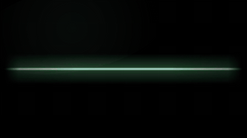

# Technical

Visual family · Interfaces, terminals, and charts.

[← All styles](../../README.md)

**By use case:** [Explainers](../../categories/use-cases/explainer.md) (9) · [Tutorials & Training](../../categories/use-cases/tutorial.md) (2) · [Product & Launches](../../categories/use-cases/product.md) (5) · [Social & Short-Form](../../categories/use-cases/social.md) (7) · [Storytelling & Brand](../../categories/use-cases/story.md) (11) · [Data & Results](../../categories/use-cases/data.md) (3) · [News & Current Affairs](../../categories/use-cases/news.md) (2) · [Intros, Titles & Transitions](../../categories/use-cases/titles.md) (5)

**By visual family:** [Flat Graphics](../../categories/families/flat-graphics.md) (4) · [Hand Drawn](../../categories/families/hand-drawn.md) (4) · [Texture & Craft](../../categories/families/texture-craft.md) (5) · [Nostalgia](../../categories/families/nostalgia.md) (4) · [Technical](../../categories/families/technical.md) (3) · [Experimental](../../categories/families/experimental.md) (1)

<table>
<tr>
<td width="25%" align="center"> <b>17 · Terminal</b> <a href="../../styles/terminal/terminal.mp4">video</a> · <a href="../../styles/terminal">source</a></td>
<td width="25%" align="center"> <b>18 · Sci-Fi Interface</b> <a href="../../styles/sci-fi-interface/sci-fi-interface.mp4">video</a> · <a href="../../styles/sci-fi-interface">source</a></td>
<td width="25%" align="center"> <b>19 · Data Visualization</b> <a href="../../styles/data-visualization/data-visualization.mp4">video</a> · <a href="../../styles/data-visualization">source</a></td>
</tr>
</table>

| # | Style | Feel | Best for | Family | Use cases |
|---|---|---|---|---|---|
| 17 | [Terminal](../../styles/terminal/) | Green phosphor command line | Technical processes and what happens behind the scenes | [Technical](../../categories/families/technical.md) | [Explainers](../../categories/use-cases/explainer.md), [Product & Launches](../../categories/use-cases/product.md) |
| 18 | [Sci-Fi Interface](../../styles/sci-fi-interface/) | Cool HUD, radar, and analysis | Measurement, scoring, and diagnostics | [Technical](../../categories/families/technical.md) | [Data & Results](../../categories/use-cases/data.md), [Product & Launches](../../categories/use-cases/product.md) |
| 19 | [Data Visualization](../../styles/data-visualization/) | Editorial charts | Evidence in numbers and before/after comparisons | [Technical](../../categories/families/technical.md) | [Data & Results](../../categories/use-cases/data.md), [News & Current Affairs](../../categories/use-cases/news.md) |
