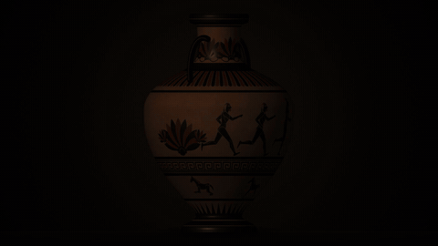
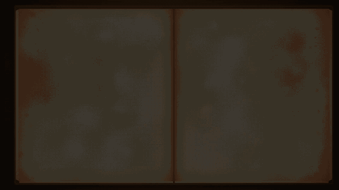
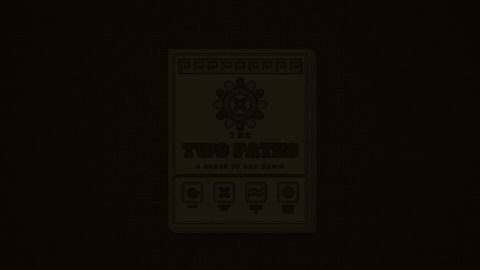
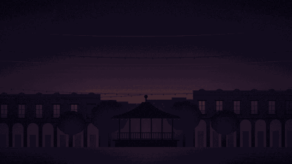

# World & History

Visual family · Art traditions from cultures and eras around the world.

[← All styles](../../README.md)

**By use case:** [Explainers](../../categories/use-cases/explainer.md) (32) · [Tutorials & Training](../../categories/use-cases/tutorial.md) (8) · [Product & Launches](../../categories/use-cases/product.md) (18) · [Social & Short-Form](../../categories/use-cases/social.md) (48) · [Storytelling & Brand](../../categories/use-cases/story.md) (55) · [Data & Results](../../categories/use-cases/data.md) (8) · [News & Current Affairs](../../categories/use-cases/news.md) (7) · [Intros, Titles & Transitions](../../categories/use-cases/titles.md) (30)

**By visual family:** [Flat Graphics](../../categories/families/flat-graphics.md) (7) · [Art Movements](../../categories/families/art-movements.md) (6) · [Hand Drawn](../../categories/families/hand-drawn.md) (8) · [Texture & Craft](../../categories/families/texture-craft.md) (15) · [Nostalgia](../../categories/families/nostalgia.md) (9) · [Technical](../../categories/families/technical.md) (8) · [Experimental](../../categories/families/experimental.md) (8) · [Polished & Premium](../../categories/families/polished.md) (2) · [Generative & 3D](../../categories/families/generative-3d.md) (8) · [Comics & Cartoons](../../categories/families/comics.md) (17) · [Games](../../categories/families/games.md) (8) · [World & History](../../categories/families/world-history.md) (13)

<table>
<tr>
<td width="25%" align="center"> <b>93 · Roman Mosaic</b> <a href="../../styles/roman-mosaic/roman-mosaic.mp4">video</a> · <a href="../../styles/roman-mosaic">source</a></td>
<td width="25%" align="center"> <b>94 · Greek Black-Figure</b> <a href="../../styles/greek-pottery/greek-pottery.mp4">video</a> · <a href="../../styles/greek-pottery">source</a></td>
<td width="25%" align="center"> <b>95 · Egyptian Papyrus</b> <a href="../../styles/egyptian-papyrus/egyptian-papyrus.mp4">video</a> · <a href="../../styles/egyptian-papyrus">source</a></td>
<td width="25%" align="center"> <b>96 · Norse Runestone</b> <a href="../../styles/viking-runes/viking-runes.mp4">video</a> · <a href="../../styles/viking-runes">source</a></td>
</tr>
<tr>
<td width="25%" align="center"> <b>97 · Illuminated Manuscript</b> <a href="../../styles/illuminated-manuscript/illuminated-manuscript.mp4">video</a> · <a href="../../styles/illuminated-manuscript">source</a></td>
<td width="25%" align="center"> <b>98 · Medieval Tapestry</b> <a href="../../styles/bayeux-tapestry/bayeux-tapestry.mp4">video</a> · <a href="../../styles/bayeux-tapestry">source</a></td>
<td width="25%" align="center"> <b>99 · Chinese Handscroll</b> <a href="../../styles/chinese-scroll/chinese-scroll.mp4">video</a> · <a href="../../styles/chinese-scroll">source</a></td>
<td width="25%" align="center"> <b>100 · Chinese Paper-Cut</b> <a href="../../styles/chinese-papercut/chinese-papercut.mp4">video</a> · <a href="../../styles/chinese-papercut">source</a></td>
</tr>
<tr>
<td width="25%" align="center"> <b>101 · Persian Miniature</b> <a href="../../styles/persian-miniature/persian-miniature.mp4">video</a> · <a href="../../styles/persian-miniature">source</a></td>
<td width="25%" align="center"> <b>102 · Geometric Tilework</b> <a href="../../styles/islamic-geometric/islamic-geometric.mp4">video</a> · <a href="../../styles/islamic-geometric">source</a></td>
<td width="25%" align="center"> <b>103 · Cave Painting</b> <a href="../../styles/cave-painting/cave-painting.mp4">video</a> · <a href="../../styles/cave-painting">source</a></td>
<td width="25%" align="center"> <b>104 · Codex</b> <a href="../../styles/mesoamerican-codex/mesoamerican-codex.mp4">video</a> · <a href="../../styles/mesoamerican-codex">source</a></td>
</tr>
<tr>
<td width="25%" align="center"> <b>106 · Papel Picado</b> <a href="../../styles/papel-picado/papel-picado.mp4">video</a> · <a href="../../styles/papel-picado">source</a></td>
</tr>
</table>

| # | Style | Feel | Best for | Family | Use cases |
|---|---|---|---|---|---|
| 93 | [Roman Mosaic](../../styles/roman-mosaic/) | Stone tesserae laid row by row | Classical welcomes, grand titles and timeless heritage stories | [World & History](../../categories/families/world-history.md) | [Storytelling & Brand](../../categories/use-cases/story.md), [Intros, Titles & Transitions](../../categories/use-cases/titles.md) |
| 94 | [Greek Black-Figure](../../styles/greek-pottery/) | Turning amphora, incised black silhouettes | Ancient history, origin stories, and myths told in profile | [World & History](../../categories/families/world-history.md) | [Storytelling & Brand](../../categories/use-cases/story.md), [Explainers](../../categories/use-cases/explainer.md) |
| 95 | [Egyptian Papyrus](../../styles/egyptian-papyrus/) | Registers, mineral pigments, cartouche titles | Ancient processes, step-by-step history, and seasonal cycles | [World & History](../../categories/families/world-history.md) | [Explainers](../../categories/use-cases/explainer.md), [Storytelling & Brand](../../categories/use-cases/story.md) |
| 96 | [Norse Runestone](../../styles/viking-runes/) | Chiselled granite, ochre serpent, torchlight | Epic titles, legacy stories and things built to last | [World & History](../../categories/families/world-history.md) | [Intros, Titles & Transitions](../../categories/use-cases/titles.md), [Storytelling & Brand](../../categories/use-cases/story.md) |
| 97 | [Illuminated Manuscript](../../styles/illuminated-manuscript/) | Gilded initials, blackletter, mischievous marginalia | Medieval titles, recipes, chronicles, and storybook openings | [World & History](../../categories/families/world-history.md) | [Intros, Titles & Transitions](../../categories/use-cases/titles.md), [Storytelling & Brand](../../categories/use-cases/story.md) |
| 98 | [Medieval Tapestry](../../styles/bayeux-tapestry/) | Couched wool on linen, stitched captions | Journeys, chronicles, and step-by-step stories told in sequence | [World & History](../../categories/families/world-history.md) | [Storytelling & Brand](../../categories/use-cases/story.md), [Explainers](../../categories/use-cases/explainer.md) |
| 99 | [Chinese Handscroll](../../styles/chinese-scroll/) | Silk, mineral peaks, cinnabar seal | Journeys, unfolding stories and serene title openers | [World & History](../../categories/families/world-history.md) | [Storytelling & Brand](../../categories/use-cases/story.md), [Intros, Titles & Transitions](../../categories/use-cases/titles.md) |
| 100 | [Chinese Paper-Cut](../../styles/chinese-papercut/) | Red lace cut live, then unfolded | Festive titles, greetings and heritage social posts | [World & History](../../categories/families/world-history.md) | [Intros, Titles & Transitions](../../categories/use-cases/titles.md), [Social & Short-Form](../../categories/use-cases/social.md) |
| 101 | [Persian Miniature](../../styles/persian-miniature/) | Jewel pigments, gold skies, tilted gardens | Fables, poetic proverbs, and gentle storybook journeys | [World & History](../../categories/families/world-history.md) | [Storytelling & Brand](../../categories/use-cases/story.md) |
| 102 | [Geometric Tilework](../../styles/islamic-geometric/) | Compass-drawn stars, glazed in cobalt | Elegant titles and explainers about pattern, symmetry and craft | [World & History](../../categories/families/world-history.md) | [Intros, Titles & Transitions](../../categories/use-cases/titles.md), [Explainers](../../categories/use-cases/explainer.md) |
| 103 | [Cave Painting](../../styles/cave-painting/) | Ochre herds revealed by torchlight | Origin stories, deep history, and the roots of storytelling | [World & History](../../categories/families/world-history.md) | [Storytelling & Brand](../../categories/use-cases/story.md), [Explainers](../../categories/use-cases/explainer.md) |
| 104 | [Codex](../../styles/mesoamerican-codex/) | Screenfold unfolds, painted animals wake | Journeys, origin stories and history explainers | [World & History](../../categories/families/world-history.md) | [Storytelling & Brand](../../categories/use-cases/story.md), [Explainers](../../categories/use-cases/explainer.md) |
| 106 | [Papel Picado](../../styles/papel-picado/) | Cut tissue, string lights, fiesta dusk | Festive titles, event invites, and celebratory social posts | [World & History](../../categories/families/world-history.md) | [Intros, Titles & Transitions](../../categories/use-cases/titles.md), [Social & Short-Form](../../categories/use-cases/social.md) |
