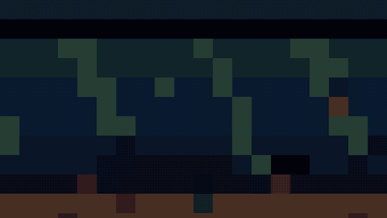

# Data & Results

Use case · Metrics, before/after comparisons, and reports.

[← All styles](../../README.md)

**By use case:** [Explainers](../../categories/use-cases/explainer.md) (30) · [Tutorials & Training](../../categories/use-cases/tutorial.md) (8) · [Product & Launches](../../categories/use-cases/product.md) (18) · [Social & Short-Form](../../categories/use-cases/social.md) (46) · [Storytelling & Brand](../../categories/use-cases/story.md) (52) · [Data & Results](../../categories/use-cases/data.md) (8) · [News & Current Affairs](../../categories/use-cases/news.md) (7) · [Intros, Titles & Transitions](../../categories/use-cases/titles.md) (29)

**By visual family:** [Flat Graphics](../../categories/families/flat-graphics.md) (7) · [Art Movements](../../categories/families/art-movements.md) (6) · [Hand Drawn](../../categories/families/hand-drawn.md) (8) · [Texture & Craft](../../categories/families/texture-craft.md) (15) · [Nostalgia](../../categories/families/nostalgia.md) (9) · [Technical](../../categories/families/technical.md) (8) · [Experimental](../../categories/families/experimental.md) (7) · [Polished & Premium](../../categories/families/polished.md) (2) · [Generative & 3D](../../categories/families/generative-3d.md) (8) · [Comics & Cartoons](../../categories/families/comics.md) (17) · [Games](../../categories/families/games.md) (8) · [World & History](../../categories/families/world-history.md) (9)

<table>
<tr>
<td width="25%" align="center"> <b>14 · Pixel Art</b> <a href="../../styles/pixel-art/pixel-art.mp4">video</a> · <a href="../../styles/pixel-art">source</a></td>
<td width="25%" align="center"> <b>18 · Sci-Fi Interface</b> <a href="../../styles/sci-fi-interface/sci-fi-interface.mp4">video</a> · <a href="../../styles/sci-fi-interface">source</a></td>
<td width="25%" align="center"> <b>19 · Data Visualization</b> <a href="../../styles/data-visualization/data-visualization.mp4">video</a> · <a href="../../styles/data-visualization">source</a></td>
<td width="25%" align="center"> <b>24 · 3Blue1Brown</b> <a href="../../styles/3blue1brown/3blue1brown.mp4">video</a> · <a href="../../styles/3blue1brown">source</a></td>
</tr>
<tr>
<td width="25%" align="center"> <b>49 · Generative Particles</b> <a href="../../styles/particles/particles.mp4">video</a> · <a href="../../styles/particles">source</a></td>
<td width="25%" align="center"> <b>69 · 8-Bit Console</b> <a href="../../styles/nes-8bit/nes-8bit.mp4">video</a> · <a href="../../styles/nes-8bit">source</a></td>
<td width="25%" align="center"> <b>77 · Blob Simulation</b> <a href="../../styles/blob-sim/blob-sim.mp4">video</a> · <a href="../../styles/blob-sim">source</a></td>
<td width="25%" align="center"> <b>87 · Stick-Figure Webcomic</b> <a href="../../styles/stick-webcomic/stick-webcomic.mp4">video</a> · <a href="../../styles/stick-webcomic">source</a></td>
</tr>
</table>

| # | Style | Feel | Best for | Family | Use cases |
|---|---|---|---|---|---|
| 14 | [Pixel Art](../../styles/pixel-art/) | 16-bit platform game | Progress, milestones, and game-like scenes | [Games](../../categories/families/games.md) | [Social & Short-Form](../../categories/use-cases/social.md), [Storytelling & Brand](../../categories/use-cases/story.md), [Data & Results](../../categories/use-cases/data.md) |
| 18 | [Sci-Fi Interface](../../styles/sci-fi-interface/) | Cool HUD, radar, and analysis | Measurement, scoring, and diagnostics | [Technical](../../categories/families/technical.md) | [Data & Results](../../categories/use-cases/data.md), [Product & Launches](../../categories/use-cases/product.md) |
| 19 | [Data Visualization](../../styles/data-visualization/) | Editorial charts | Evidence in numbers and before/after comparisons | [Technical](../../categories/families/technical.md) | [Data & Results](../../categories/use-cases/data.md), [News & Current Affairs](../../categories/use-cases/news.md) |
| 24 | [3Blue1Brown](../../styles/3blue1brown/) | Manim-style math on black | Math intuition, visual proofs, and step-by-step derivations | [Technical](../../categories/families/technical.md) | [Explainers](../../categories/use-cases/explainer.md), [Tutorials & Training](../../categories/use-cases/tutorial.md), [Data & Results](../../categories/use-cases/data.md) |
| 49 | [Generative Particles](../../styles/particles/) | Luminous flow-field particle swarms | Tech title reveals, data stories, and abstract openers | [Generative & 3D](../../categories/families/generative-3d.md) | [Intros, Titles & Transitions](../../categories/use-cases/titles.md), [Data & Results](../../categories/use-cases/data.md) |
| 69 | [8-Bit Console](../../styles/nes-8bit/) | Third-generation console cartridge game | Playful quests, streaks, scores, and level-up moments | [Games](../../categories/families/games.md) | [Social & Short-Form](../../categories/use-cases/social.md), [Data & Results](../../categories/use-cases/data.md) |
| 77 | [Blob Simulation](../../styles/blob-sim/) | Cute 3D blobs obeying simple rules | Game theory, evolution sims, and data-driven explainers | [Generative & 3D](../../categories/families/generative-3d.md) | [Explainers](../../categories/use-cases/explainer.md), [Data & Results](../../categories/use-cases/data.md) |
| 87 | [Stick-Figure Webcomic](../../styles/stick-webcomic/) | Dry nerdy wit in black ink | Wry explainers, tradeoffs, and charts with a punchline | [Comics & Cartoons](../../categories/families/comics.md) | [Explainers](../../categories/use-cases/explainer.md), [Data & Results](../../categories/use-cases/data.md) |
