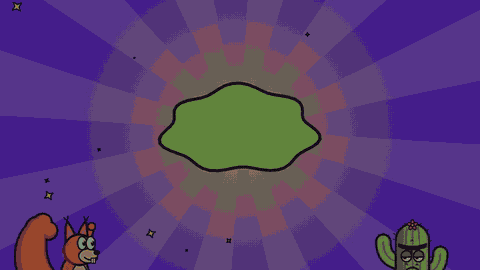
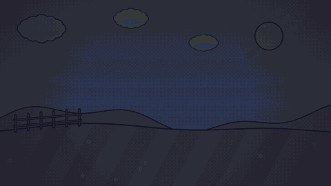

# Social & Short-Form

Use case · Reels, Shorts, ads, hooks, and quick announcements.

[← All styles](../../README.md)

**By use case:** [Explainers](../../categories/use-cases/explainer.md) (33) · [Tutorials & Training](../../categories/use-cases/tutorial.md) (8) · [Product & Launches](../../categories/use-cases/product.md) (18) · [Social & Short-Form](../../categories/use-cases/social.md) (51) · [Storytelling & Brand](../../categories/use-cases/story.md) (59) · [Data & Results](../../categories/use-cases/data.md) (8) · [News & Current Affairs](../../categories/use-cases/news.md) (7) · [Intros, Titles & Transitions](../../categories/use-cases/titles.md) (34)

**By visual family:** [Flat Graphics](../../categories/families/flat-graphics.md) (8) · [Art Movements](../../categories/families/art-movements.md) (8) · [Hand Drawn](../../categories/families/hand-drawn.md) (9) · [Texture & Craft](../../categories/families/texture-craft.md) (15) · [Nostalgia](../../categories/families/nostalgia.md) (9) · [Technical](../../categories/families/technical.md) (8) · [Experimental](../../categories/families/experimental.md) (9) · [Polished & Premium](../../categories/families/polished.md) (2) · [Generative & 3D](../../categories/families/generative-3d.md) (8) · [Comics & Cartoons](../../categories/families/comics.md) (18) · [Games](../../categories/families/games.md) (8) · [World & History](../../categories/families/world-history.md) (14)

<table>
<tr>
<td width="25%" align="center"> <b>2000s Digital Comic</b> <a href="../../styles/digital-comic/digital-comic.mp4">video</a> · <a href="../../styles/digital-comic">source</a></td>
<td width="25%" align="center"> <b>8-Bit Console</b> <a href="../../styles/nes-8bit/nes-8bit.mp4">video</a> · <a href="../../styles/nes-8bit">source</a></td>
<td width="25%" align="center"> <b>Absurd Minimal</b> Inspired by <a href="https://billwurtz.com">Bill Wurtz</a> <a href="../../styles/absurd-minimal/absurd-minimal.mp4">video</a> · <a href="../../styles/absurd-minimal">source</a></td>
<td width="25%" align="center"> <b>Absurd Single Panel</b> Inspired by The Far Side (Gary Larson) <a href="../../styles/single-panel-absurd/single-panel-absurd.mp4">video</a> · <a href="../../styles/single-panel-absurd">source</a></td>
</tr>
<tr>
<td width="25%" align="center"> <b>Absurd Webcomic</b> Inspired by <a href="https://theoatmeal.com">The Oatmeal (Matthew Inman)</a> <a href="../../styles/absurd-webcomic/absurd-webcomic.mp4">video</a> · <a href="../../styles/absurd-webcomic">source</a></td>
<td width="25%" align="center"> <b>Atomic Wasteland</b> Inspired by Fallout's Pip-Boy and Vault Boy <a href="../../styles/atomic-wasteland/atomic-wasteland.mp4">video</a> · <a href="../../styles/atomic-wasteland">source</a></td>
<td width="25%" align="center"> <b>Bauhaus</b> Originally developed by <a href="https://github.com/yasinozmeen/animasyon-stil-katalogu">Yasin Özmen</a> <a href="../../styles/bauhaus/bauhaus.mp4">video</a> · <a href="../../styles/bauhaus">source</a></td>
<td width="25%" align="center"> <b>Bold Captions</b> <a href="../../styles/bold-captions/bold-captions.mp4">video</a> · <a href="../../styles/bold-captions">source</a></td>
</tr>
<tr>
<td width="25%" align="center"> <b>Chat Story</b> <a href="../../styles/chat-story/chat-story.mp4">video</a> · <a href="../../styles/chat-story">source</a></td>
<td width="25%" align="center"> <b>Chinese Paper-Cut</b> <a href="../../styles/chinese-papercut/chinese-papercut.mp4">video</a> · <a href="../../styles/chinese-papercut">source</a></td>
<td width="25%" align="center"> <b>Clay</b> Originally developed by <a href="https://github.com/yasinozmeen/animasyon-stil-katalogu">Yasin Özmen</a> <a href="../../styles/clay/clay.mp4">video</a> · <a href="../../styles/clay">source</a></td>
<td width="25%" align="center"> <b>Comic Book</b> Originally developed by <a href="https://github.com/yasinozmeen/animasyon-stil-katalogu">Yasin Özmen</a> <a href="../../styles/comic-book/comic-book.mp4">video</a> · <a href="../../styles/comic-book">source</a></td>
</tr>
<tr>
<td width="25%" align="center"> <b>Constructivism</b> <a href="../../styles/constructivism/constructivism.mp4">video</a> · <a href="../../styles/constructivism">source</a></td>
<td width="25%" align="center"> <b>Embroidery</b> <a href="../../styles/embroidery/embroidery.mp4">video</a> · <a href="../../styles/embroidery">source</a></td>
<td width="25%" align="center"> <b>Flash Cartoon</b> <a href="../../styles/flash-cartoon/flash-cartoon.mp4">video</a> · <a href="../../styles/flash-cartoon">source</a></td>
<td width="25%" align="center"> <b>Frutiger Aero</b> <a href="../../styles/frutiger-aero/frutiger-aero.mp4">video</a> · <a href="../../styles/frutiger-aero">source</a></td>
</tr>
<tr>
<td width="25%" align="center"> <b>Glitch</b> <a href="../../styles/glitch/glitch.mp4">video</a> · <a href="../../styles/glitch">source</a></td>
<td width="25%" align="center"> <b>Golden Age Comic</b> <a href="../../styles/golden-age-comic/golden-age-comic.mp4">video</a> · <a href="../../styles/golden-age-comic">source</a></td>
<td width="25%" align="center"> <b>Handheld LCD</b> Inspired by the original Game Boy <a href="../../styles/handheld-lcd/handheld-lcd.mp4">video</a> · <a href="../../styles/handheld-lcd">source</a></td>
<td width="25%" align="center"> <b>Inflated 3D</b> <a href="../../styles/inflated-3d/inflated-3d.mp4">video</a> · <a href="../../styles/inflated-3d">source</a></td>
</tr>
<tr>
<td width="25%" align="center"> <b>JRPG Battle</b> <a href="../../styles/jrpg/jrpg.mp4">video</a> · <a href="../../styles/jrpg">source</a></td>
<td width="25%" align="center"> <b>Kawaii</b> <a href="../../styles/kawaii/kawaii.mp4">video</a> · <a href="../../styles/kawaii">source</a></td>
<td width="25%" align="center"> <b>Kinetic Typography</b> Originally developed by <a href="https://github.com/yasinozmeen/animasyon-stil-katalogu">Yasin Özmen</a> <a href="../../styles/kinetic-typography/kinetic-typography.mp4">video</a> · <a href="../../styles/kinetic-typography">source</a></td>
<td width="25%" align="center"> <b>Linocut</b> Originally developed by <a href="https://github.com/yasinozmeen/animasyon-stil-katalogu">Yasin Özmen</a> <a href="../../styles/linocut/linocut.mp4">video</a> · <a href="../../styles/linocut">source</a></td>
</tr>
<tr>
<td width="25%" align="center"> <b>Madhubani</b> <a href="../../styles/madhubani/madhubani.mp4">video</a> · <a href="../../styles/madhubani">source</a></td>
<td width="25%" align="center"> <b>Magazine Cartoon</b> Inspired by <a href="https://www.newyorker.com/cartoons">The New Yorker's cartoons</a> <a href="../../styles/magazine-cartoon/magazine-cartoon.mp4">video</a> · <a href="../../styles/magazine-cartoon">source</a></td>
<td width="25%" align="center"> <b>Manga</b> <a href="../../styles/manga/manga.mp4">video</a> · <a href="../../styles/manga">source</a></td>
<td width="25%" align="center"> <b>Memphis</b> Originally developed by <a href="https://github.com/yasinozmeen/animasyon-stil-katalogu">Yasin Özmen</a> <a href="../../styles/memphis/memphis.mp4">video</a> · <a href="../../styles/memphis">source</a></td>
</tr>
<tr>
<td width="25%" align="center"> <b>Mixed-Media Collage</b> <a href="../../styles/collage/collage.mp4">video</a> · <a href="../../styles/collage">source</a></td>
<td width="25%" align="center"> <b>Neo-Brutalism</b> <a href="../../styles/neo-brutalism/neo-brutalism.mp4">video</a> · <a href="../../styles/neo-brutalism">source</a></td>
<td width="25%" align="center"> <b>Newspaper Comic Strip</b> <a href="../../styles/comic-strip/comic-strip.mp4">video</a> · <a href="../../styles/comic-strip">source</a></td>
<td width="25%" align="center"> <b>Newspaper Headline</b> <a href="../../styles/newspaper/newspaper.mp4">video</a> · <a href="../../styles/newspaper">source</a></td>
</tr>
<tr>
<td width="25%" align="center"> <b>Office Satire Strip</b> Inspired by Dilbert (Scott Adams) <a href="../../styles/office-strip/office-strip.mp4">video</a> · <a href="../../styles/office-strip">source</a></td>
<td width="25%" align="center"> <b>Paint Doodle</b> Inspired by Sam O'Nella Academy <a href="../../styles/paint-doodle/paint-doodle.mp4">video</a> · <a href="../../styles/paint-doodle">source</a></td>
<td width="25%" align="center"> <b>Papel Picado</b> <a href="../../styles/papel-picado/papel-picado.mp4">video</a> · <a href="../../styles/papel-picado">source</a></td>
<td width="25%" align="center"> <b>Pixel Art</b> Originally developed by <a href="https://github.com/yasinozmeen/animasyon-stil-katalogu">Yasin Özmen</a> <a href="../../styles/pixel-art/pixel-art.mp4">video</a> · <a href="../../styles/pixel-art">source</a></td>
</tr>
<tr>
<td width="25%" align="center"> <b>Point-and-Click Adventure</b> <a href="../../styles/point-and-click/point-and-click.mp4">video</a> · <a href="../../styles/point-and-click">source</a></td>
<td width="25%" align="center"> <b>Relatable Webcomic</b> Inspired by Sarah's Scribbles (Sarah Andersen) <a href="../../styles/relatable-webcomic/relatable-webcomic.mp4">video</a> · <a href="../../styles/relatable-webcomic">source</a></td>
<td width="25%" align="center"> <b>Risograph</b> <a href="../../styles/risograph/risograph.mp4">video</a> · <a href="../../styles/risograph">source</a></td>
<td width="25%" align="center"> <b>Round-Head Dark Humor</b> Inspired by <a href="https://explosm.net">Cyanide & Happiness</a> <a href="../../styles/round-head-dark/round-head-dark.mp4">video</a> · <a href="../../styles/round-head-dark">source</a></td>
</tr>
<tr>
<td width="25%" align="center"> <b>Rubber Hose</b> <a href="../../styles/rubber-hose/rubber-hose.mp4">video</a> · <a href="../../styles/rubber-hose">source</a></td>
<td width="25%" align="center"> <b>Saturday Morning Cartoon</b> <a href="../../styles/saturday-cartoon/saturday-cartoon.mp4">video</a> · <a href="../../styles/saturday-cartoon">source</a></td>
<td width="25%" align="center"> <b>Stick-Figure Action</b> Inspired by Alan Becker <a href="../../styles/stick-action/stick-action.mp4">video</a> · <a href="../../styles/stick-action">source</a></td>
<td width="25%" align="center"> <b>Storytime Animation</b> Inspired by Jaiden Animations and TheOdd1sOut <a href="../../styles/storytime/storytime.mp4">video</a> · <a href="../../styles/storytime">source</a></td>
</tr>
<tr>
<td width="25%" align="center"> <b>Sunday Watercolor Strip</b> Inspired by Calvin and Hobbes (Bill Watterson) <a href="../../styles/sunday-strip/sunday-strip.mp4">video</a> · <a href="../../styles/sunday-strip">source</a></td>
<td width="25%" align="center"> <b>Surreal Replication</b> Inspired by Cyriak <a href="../../styles/surreal-loop/surreal-loop.mp4">video</a> · <a href="../../styles/surreal-loop">source</a></td>
<td width="25%" align="center"> <b>Synthwave</b> <a href="../../styles/synthwave/synthwave.mp4">video</a> · <a href="../../styles/synthwave">source</a></td>
<td width="25%" align="center"> <b>Underground Comix</b> <a href="../../styles/underground-comix/underground-comix.mp4">video</a> · <a href="../../styles/underground-comix">source</a></td>
</tr>
<tr>
<td width="25%" align="center"> <b>Vector Arcade</b> <a href="../../styles/vector-arcade/vector-arcade.mp4">video</a> · <a href="../../styles/vector-arcade">source</a></td>
<td width="25%" align="center"> <b>VHS Camcorder</b> <a href="../../styles/vhs-camcorder/vhs-camcorder.mp4">video</a> · <a href="../../styles/vhs-camcorder">source</a></td>
<td width="25%" align="center"> <b>Victorian Engraving</b> <a href="../../styles/victorian-engraving/victorian-engraving.mp4">video</a> · <a href="../../styles/victorian-engraving">source</a></td>
</tr>
</table>

| Style | Feel | Best for | Family | Use cases |
|---|---|---|---|---|
| [2000s Digital Comic](../../styles/digital-comic/) | Glossy airbrush, rim light, flares | Launch teasers, hero moments and high-energy product reveals | [Comics & Cartoons](../../categories/families/comics.md) | [Product & Launches](../../categories/use-cases/product.md), [Social & Short-Form](../../categories/use-cases/social.md) |
| [8-Bit Console](../../styles/nes-8bit/) | Third-generation console cartridge game | Playful quests, streaks, scores, and level-up moments | [Games](../../categories/families/games.md) | [Social & Short-Form](../../categories/use-cases/social.md), [Data & Results](../../categories/use-cases/data.md) |
| [Absurd Minimal](../../styles/absurd-minimal/) | Fast deadpan doodles on loud color | Rapid-fire explainers and history told with a shrug | [Experimental](../../categories/families/experimental.md) | [Explainers](../../categories/use-cases/explainer.md), [Social & Short-Form](../../categories/use-cases/social.md) |
| [Absurd Single Panel](../../styles/single-panel-absurd/) | Deadpan rural absurdity, ink and wash | One-line punchlines about nature, science and odd points of view | [Comics & Cartoons](../../categories/families/comics.md) | [Social & Short-Form](../../categories/use-cases/social.md) |
| [Absurd Webcomic](../../styles/absurd-webcomic/) | Loud flat cartoons, unhinged overreactions | Relatable gripes, product pain points, and escalating social gags | [Comics & Cartoons](../../categories/families/comics.md) | [Social & Short-Form](../../categories/use-cases/social.md), [Product & Launches](../../categories/use-cases/product.md) |
| [Atomic Wasteland](../../styles/atomic-wasteland/) | Cheerful 50s mascot, burning world | Dark satire, survival tips, and deadpan corporate optimism | [Games](../../categories/families/games.md) | [Social & Short-Form](../../categories/use-cases/social.md), [Explainers](../../categories/use-cases/explainer.md) |
| [Bauhaus](../../styles/bauhaus/) | Poster grid and basic shapes | Steps, principles, and bold messages | [Art Movements](../../categories/families/art-movements.md) | [Social & Short-Form](../../categories/use-cases/social.md), [Intros, Titles & Transitions](../../categories/use-cases/titles.md), [Explainers](../../categories/use-cases/explainer.md) |
| [Bold Captions](../../styles/bold-captions/) | Word-by-word punchy short-form captions | Reels, Shorts and quick tips that must hook fast | [Experimental](../../categories/families/experimental.md) | [Social & Short-Form](../../categories/use-cases/social.md), [Tutorials & Training](../../categories/use-cases/tutorial.md) |
| [Chat Story](../../styles/chat-story/) | A story told in phone messages | Funny exchanges, twists, and relatable social moments | [Technical](../../categories/families/technical.md) | [Storytelling & Brand](../../categories/use-cases/story.md), [Social & Short-Form](../../categories/use-cases/social.md) |
| [Chinese Paper-Cut](../../styles/chinese-papercut/) | Red lace cut live, then unfolded | Festive titles, greetings and heritage social posts | [World & History](../../categories/families/world-history.md) | [Intros, Titles & Transitions](../../categories/use-cases/titles.md), [Social & Short-Form](../../categories/use-cases/social.md) |
| [Clay](../../styles/clay/) | Warm stop motion | Friendly, playful storytelling | [Texture & Craft](../../categories/families/texture-craft.md) | [Storytelling & Brand](../../categories/use-cases/story.md), [Social & Short-Form](../../categories/use-cases/social.md) |
| [Comic Book](../../styles/comic-book/) | Newspaper comic panels | Dialogue, humor, and tension | [Comics & Cartoons](../../categories/families/comics.md) | [Storytelling & Brand](../../categories/use-cases/story.md), [Social & Short-Form](../../categories/use-cases/social.md) |
| [Constructivism](../../styles/constructivism/) | Red wedges and shouting diagonals | Calls to action, manifestos, and loud announcements | [Art Movements](../../categories/families/art-movements.md) | [Social & Short-Form](../../categories/use-cases/social.md), [News & Current Affairs](../../categories/use-cases/news.md) |
| [Embroidery](../../styles/embroidery/) | Hand-stitched thread in a wooden hoop | Heartfelt stories, handmade brands, and cozy social posts | [Texture & Craft](../../categories/families/texture-craft.md) | [Storytelling & Brand](../../categories/use-cases/story.md), [Social & Short-Form](../../categories/use-cases/social.md) |
| [Flash Cartoon](../../styles/flash-cartoon/) | Mid-2000s web toon, tweened and glossy | Silly social loops, playful intros, and nostalgic web humor | [Experimental](../../categories/families/experimental.md) | [Social & Short-Form](../../categories/use-cases/social.md) |
| [Frutiger Aero](../../styles/frutiger-aero/) | Glossy bubbles, blue skies, green grass | Cheerful app launches, playful promos, and nostalgic social posts | [Nostalgia](../../categories/families/nostalgia.md) | [Social & Short-Form](../../categories/use-cases/social.md), [Product & Launches](../../categories/use-cases/product.md) |
| [Glitch](../../styles/glitch/) | Corrupted digital signal, beat-synced | Bold title hits, reveals, and high-energy social openers | [Experimental](../../categories/families/experimental.md) | [Intros, Titles & Transitions](../../categories/use-cases/titles.md), [Social & Short-Form](../../categories/use-cases/social.md) |
| [Golden Age Comic](../../styles/golden-age-comic/) | Pulpy, off-register 1940s heroics | Origin stories, heroic reveals, and cliffhanger teasers | [Comics & Cartoons](../../categories/families/comics.md) | [Storytelling & Brand](../../categories/use-cases/story.md), [Social & Short-Form](../../categories/use-cases/social.md) |
| [Handheld LCD](../../styles/handheld-lcd/) | Four greens on a pocket console | Playful social posts, game moments and retro nostalgia | [Games](../../categories/families/games.md) | [Social & Short-Form](../../categories/use-cases/social.md) |
| [Inflated 3D](../../styles/inflated-3d/) | Puffy pastel balloon icons that squish | Playful app features, social teasers and UI reveals | [Generative & 3D](../../categories/families/generative-3d.md) | [Product & Launches](../../categories/use-cases/product.md), [Social & Short-Form](../../categories/use-cases/social.md) |
| [JRPG Battle](../../styles/jrpg/) | 16-bit turn-based battle menus | Challenges overcome, skill unlocks, and playful explainers | [Games](../../categories/families/games.md) | [Explainers](../../categories/use-cases/explainer.md), [Social & Short-Form](../../categories/use-cases/social.md) |
| [Kawaii](../../styles/kawaii/) | Pastel chibi stickers that bounce | Cheerful social posts, cute products and friendly greetings | [Flat Graphics](../../categories/families/flat-graphics.md) | [Social & Short-Form](../../categories/use-cases/social.md), [Product & Launches](../../categories/use-cases/product.md) |
| [Kinetic Typography](../../styles/kinetic-typography/) | Words in rhythm | Quotes and strong opening lines | [Experimental](../../categories/families/experimental.md) | [Intros, Titles & Transitions](../../categories/use-cases/titles.md), [Social & Short-Form](../../categories/use-cases/social.md) |
| [Linocut](../../styles/linocut/) | Carved print in black and red | A strong single message or manifesto | [Texture & Craft](../../categories/families/texture-craft.md) | [Storytelling & Brand](../../categories/use-cases/story.md), [Social & Short-Form](../../categories/use-cases/social.md) |
| [Madhubani](../../styles/madhubani/) | Double lines, turmeric, fish and peacocks | Folk tales, festive greetings, and nature stories | [World & History](../../categories/families/world-history.md) | [Storytelling & Brand](../../categories/use-cases/story.md), [Social & Short-Form](../../categories/use-cases/social.md) |
| [Magazine Cartoon](../../styles/magazine-cartoon/) | Dry wit, pen and wash | Punchlines, wry observations, and understated social commentary | [Comics & Cartoons](../../categories/families/comics.md) | [Social & Short-Form](../../categories/use-cases/social.md), [Storytelling & Brand](../../categories/use-cases/story.md) |
| [Manga](../../styles/manga/) | Inked panels, screentone and speed lines | Tense moments, big reveals, and dramatic countdowns | [Comics & Cartoons](../../categories/families/comics.md) | [Storytelling & Brand](../../categories/use-cases/story.md), [Social & Short-Form](../../categories/use-cases/social.md) |
| [Memphis](../../styles/memphis/) | Playful, bouncing 1980s design | Fun announcements and short videos | [Art Movements](../../categories/families/art-movements.md) | [Social & Short-Form](../../categories/use-cases/social.md), [Product & Launches](../../categories/use-cases/product.md) |
| [Mixed-Media Collage](../../styles/collage/) | Torn paper, tape and halftone cutouts | Manifestos, handmade brands, and scroll-stopping social posts | [Texture & Craft](../../categories/families/texture-craft.md) | [Storytelling & Brand](../../categories/use-cases/story.md), [Social & Short-Form](../../categories/use-cases/social.md) |
| [Neo-Brutalism](../../styles/neo-brutalism/) | Chunky UI cards, hard shadows | App launches, product promos, and punchy social clips | [Flat Graphics](../../categories/families/flat-graphics.md) | [Social & Short-Form](../../categories/use-cases/social.md), [Product & Launches](../../categories/use-cases/product.md) |
| [Newspaper Comic Strip](../../styles/comic-strip/) | Four panels, ink on newsprint | Dry wit, a setup, a beat, and a punchline | [Comics & Cartoons](../../categories/families/comics.md) | [Social & Short-Form](../../categories/use-cases/social.md), [Storytelling & Brand](../../categories/use-cases/story.md) |
| [Newspaper Headline](../../styles/newspaper/) | Broadsheet front page, ink and halftone | Breaking facts, surprising findings, and documentary hooks | [Nostalgia](../../categories/families/nostalgia.md) | [News & Current Affairs](../../categories/use-cases/news.md), [Social & Short-Form](../../categories/use-cases/social.md) |
| [Office Satire Strip](../../styles/office-strip/) | Deadpan cubicle wit, flat ink | Workplace satire, buzzwords, and a dry final-panel punchline | [Comics & Cartoons](../../categories/families/comics.md) | [Social & Short-Form](../../categories/use-cases/social.md), [Storytelling & Brand](../../categories/use-cases/story.md) |
| [Paint Doodle](../../styles/paint-doodle/) | Crude mouse lines, deadpan captions | Silly history bits and dry jokes for social feeds | [Experimental](../../categories/families/experimental.md) | [Social & Short-Form](../../categories/use-cases/social.md) |
| [Papel Picado](../../styles/papel-picado/) | Cut tissue, string lights, fiesta dusk | Festive titles, event invites, and celebratory social posts | [World & History](../../categories/families/world-history.md) | [Intros, Titles & Transitions](../../categories/use-cases/titles.md), [Social & Short-Form](../../categories/use-cases/social.md) |
| [Pixel Art](../../styles/pixel-art/) | 16-bit video game level | Progress, milestones, and game-like scenes | [Games](../../categories/families/games.md) | [Social & Short-Form](../../categories/use-cases/social.md), [Storytelling & Brand](../../categories/use-cases/story.md), [Data & Results](../../categories/use-cases/data.md) |
| [Point-and-Click Adventure](../../styles/point-and-click/) | Dithered early-90s adventure game | Wry quests, puzzles, reveals, and story beats with dialogue | [Games](../../categories/families/games.md) | [Storytelling & Brand](../../categories/use-cases/story.md), [Social & Short-Form](../../categories/use-cases/social.md) |
| [Relatable Webcomic](../../styles/relatable-webcomic/) | Pastel panels, messy bun, cosy honesty | Everyday confessions, self-care gags and warm relatable punchlines | [Comics & Cartoons](../../categories/families/comics.md) | [Social & Short-Form](../../categories/use-cases/social.md), [Storytelling & Brand](../../categories/use-cases/story.md) |
| [Risograph](../../styles/risograph/) | Fluorescent overprint with halftone dots | Event posters, bold titles, and punchy social hooks | [Texture & Craft](../../categories/families/texture-craft.md) | [Social & Short-Form](../../categories/use-cases/social.md), [Intros, Titles & Transitions](../../categories/use-cases/titles.md) |
| [Round-Head Dark Humor](../../styles/round-head-dark/) | Deadpan round heads, dark punchline | Fast social gags with a dark-but-harmless twist | [Comics & Cartoons](../../categories/families/comics.md) | [Social & Short-Form](../../categories/use-cases/social.md) |
| [Rubber Hose](../../styles/rubber-hose/) | 1930s bouncing sepia cartoon | Playful gags, mascots, and nostalgic brand shorts | [Hand Drawn](../../categories/families/hand-drawn.md) | [Social & Short-Form](../../categories/use-cases/social.md), [Storytelling & Brand](../../categories/use-cases/story.md) |
| [Saturday Morning Cartoon](../../styles/saturday-cartoon/) | 90s TV toon, rubbery takes | Quick gags, character duos, and nostalgic social shorts | [Comics & Cartoons](../../categories/families/comics.md) | [Social & Short-Form](../../categories/use-cases/social.md), [Storytelling & Brand](../../categories/use-cases/story.md) |
| [Stick-Figure Action](../../styles/stick-action/) | Snappy stick-figure fights on paper | Punchy social clips, rivalries, and playful action beats | [Hand Drawn](../../categories/families/hand-drawn.md) | [Social & Short-Form](../../categories/use-cases/social.md) |
| [Storytime Animation](../../styles/storytime/) | Expressive self-insert, deadpan inner thoughts | Personal anecdotes, embarrassing mishaps, and relatable confessions | [Hand Drawn](../../categories/families/hand-drawn.md) | [Storytelling & Brand](../../categories/use-cases/story.md), [Social & Short-Form](../../categories/use-cases/social.md) |
| [Sunday Watercolor Strip](../../styles/sunday-strip/) | Brush ink, washes, imagination unleashed | Childhood daydreams, reality-vs-fantasy turns, and a dry parental punchline | [Comics & Cartoons](../../categories/families/comics.md) | [Storytelling & Brand](../../categories/use-cases/story.md), [Social & Short-Form](../../categories/use-cases/social.md) |
| [Surreal Replication](../../styles/surreal-loop/) | Cloning sheep, kaleidoscopic infinite zoom | Hypnotic loops, playful titles and scroll-stopping social openers | [Experimental](../../categories/families/experimental.md) | [Social & Short-Form](../../categories/use-cases/social.md), [Intros, Titles & Transitions](../../categories/use-cases/titles.md) |
| [Synthwave](../../styles/synthwave/) | Neon grid, chrome logo, sunset | Retro-futurist openers, series titles, and hype reels | [Nostalgia](../../categories/families/nostalgia.md) | [Intros, Titles & Transitions](../../categories/use-cases/titles.md), [Social & Short-Form](../../categories/use-cases/social.md) |
| [Underground Comix](../../styles/underground-comix/) | Boiling hatching, melting psychedelic swagger | Irreverent social clips, laid-back gags and trippy reveals | [Comics & Cartoons](../../categories/families/comics.md) | [Social & Short-Form](../../categories/use-cases/social.md) |
| [Vector Arcade](../../styles/vector-arcade/) | Glowing phosphor lines on black | Game-style openers, retro title cards, and punchy social clips | [Games](../../categories/families/games.md) | [Intros, Titles & Transitions](../../categories/use-cases/titles.md), [Social & Short-Form](../../categories/use-cases/social.md) |
| [VHS Camcorder](../../styles/vhs-camcorder/) | 90s home video on a VCR | Nostalgic memories, throwbacks, and found-footage hooks | [Nostalgia](../../categories/families/nostalgia.md) | [Storytelling & Brand](../../categories/use-cases/story.md), [Social & Short-Form](../../categories/use-cases/social.md) |
| [Victorian Engraving](../../styles/victorian-engraving/) | Engraved cut-outs, hinged heads, giant feet | Droll satire, absurd explainers, and witty social posts | [Texture & Craft](../../categories/families/texture-craft.md) | [Social & Short-Form](../../categories/use-cases/social.md), [Storytelling & Brand](../../categories/use-cases/story.md) |
