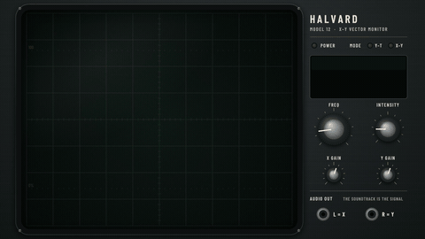

# Oscilloscope

[← All styles](../../README.md)

**Feel:** Green phosphor beam drawing sound  
**Best for:** Tech titles, signal and sound explainers, audio-reactive openers  
**Visual family:** [Technical](../../categories/families/technical.md)  
**Use cases:** [Intros, Titles & Transitions](../../categories/use-cases/titles.md), [Explainers](../../categories/use-cases/explainer.md)

▶ [Watch the clip](oscilloscope.mp4) · Source: [`anim.html`](anim.html) · rebuild with `./build.sh`
